# Spring boot

#### 1. properties

> @Value(${})			 			 从配置文件中读取值
>
> @PropertySource()			 导入自定义配置文件

#### 2. 注解

> @Configuration  配置类
>
> @Condition
>
> > @ConditionOnxxxx
> >
> > @Conditionxxxx
> >
> > 

#### 3. 配置文件

> profile 在application.yml中使用spring.profiles.active=dev激活
>
> > application-dev.yml
> >
> > application-prod.yml
> >
> > 或在application.yml 中使用 spring.profiles: dev 配置一个spring环境
> >
> > 无法使用 `@PropertySource` 注解加载 YAML 文件。
> >
> > ```
> > @ConfigurationProperties(prefix="acme")
> > ```
> >
> > > ```yml
> > > spring:
> > >   profiles:
> > >     active: dev
> > > ---
> > > server: 
> > >   port: 8081
> > > spring:
> > >   profiles: dev
> > > ---
> > > server:
> > >   port: 8080
> > > spring:
> > >   profiles: prod
> > > ```
> > >
> >

#### 4. 日志

> 1. SLF4J
>
>    >  配置文件还是做成日志实现框架的配置文件
>    >
>    > 

#### 5. webMVC扩展配置

> implement WebMvcConfigurer

#### 6. 拦截器

> implement HandlerInterceptor

#### 7. 错误页面

> 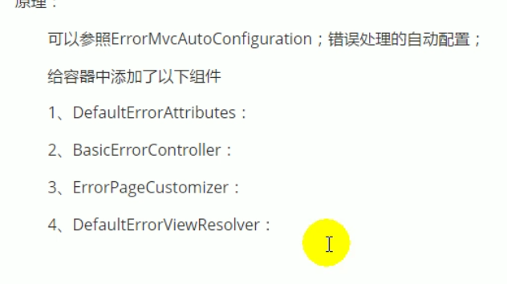

#### 8. DataSource 

> ```yaml
> resources下
> schema-*.sql   建表
> data-*.sql     数据
> 
> ---
> 或者在application.yml中的datasource下配置 schema
> spring:
>   datasource:
>     schema:
>       - classpath:aaa.sql
>       - classpath:bbb.sql
> ```

#### 9. mybaits

> @MapperScan() 扫面的包下的类不用加mapper也可以autowire

#### 10. JPA

> 　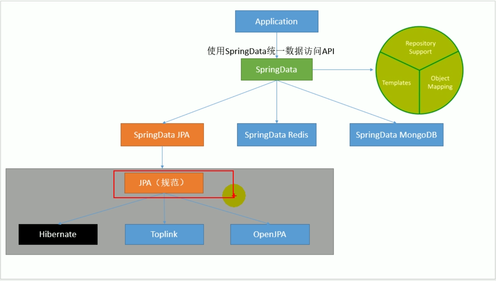
>
> 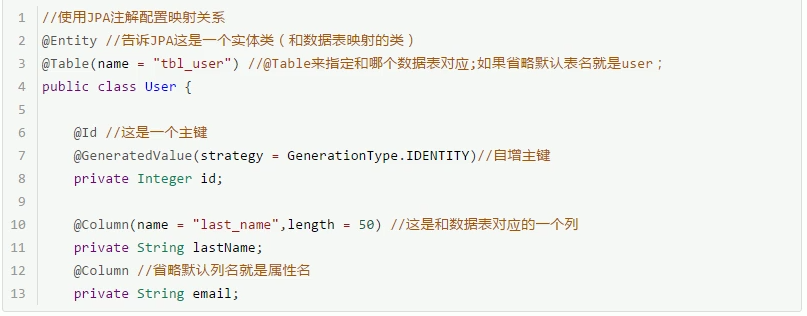
>
> 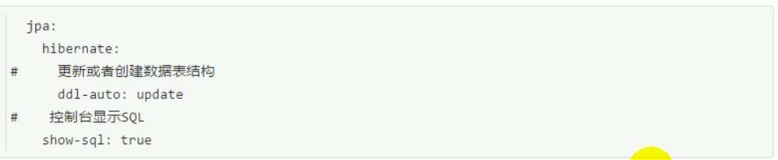

#### 11. Spring cache

> 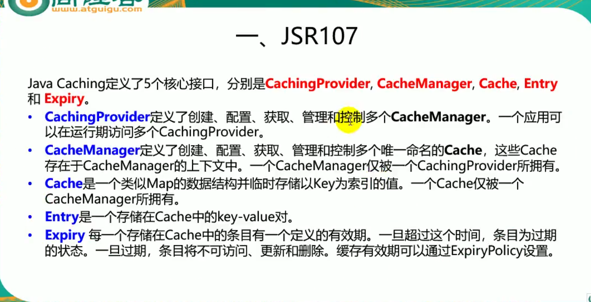
>
> 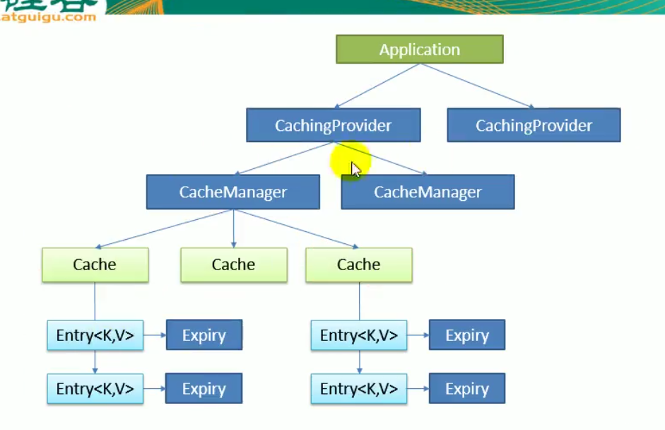
>
> * @CacheConfig
>
>   > 统一配置cacheName, cacheManager, 标在class上
>
> * @Cacheable
>
>   > key   	使用SpEL表达式
>   >
>   > 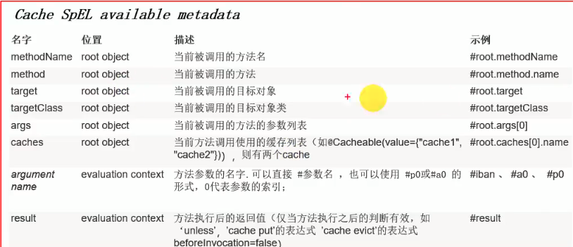
>   >
>   > condition		符合条件才进行缓存
>   >
>   > unless			 符合条件的不进行缓存
>   >
>   > syn					异步
>
> * @CachePut
>
>   > 先调用方法,再缓存方法结果(一定会更新缓存)
>
> * @CacheEvict
>
>   > 删除缓存
>
> * @Caching
>
>   > 组合缓存
>   >
>   > ```java
>   > @Caching(
>   >     cacheable = {
>   >      @Cacheable(value="emp", key="#emp.id")   
>   >     },
>   >     put = {
>   >         
>   >     },
>   >     evict = {
>   >         
>   >     }
>   > )
>   > ```
>
> ##### Redis
>
>    > ```java
>    >     @Bean
>    >     public RedisTemplate<Object, Object> redisTemplate(RedisConnectionFactory redisConnectionFactory)
>    >             throws UnknownHostException {
>    >         RedisTemplate<Object, Object> template = new RedisTemplate<>();
>    >         template.setConnectionFactory(redisConnectionFactory);
>    >         Jackson2JsonRedisSerializer<Object> jsonRedisSerializer = new Jackson2JsonRedisSerializer<>(Object.class);
>    >         template.setDefaultSerializer(jsonRedisSerializer);
>    >         return template;
>    >     }
>    > 
>    >     @Bean
>    >     public CacheManager cacheManager(RedisConnectionFactory factory) {
>    >         RedisSerializer<String> redisSerializer = new StringRedisSerializer();
>    >         Jackson2JsonRedisSerializer jackson2JsonRedisSerializer = new Jackson2JsonRedisSerializer(Object.class);
>    > 
>    >         //解决查询缓存转换异常的问题
>    >         ObjectMapper om = new ObjectMapper();
>    >         om.setVisibility(PropertyAccessor.ALL, JsonAutoDetect.Visibility.ANY);
>    >         om.enableDefaultTyping(ObjectMapper.DefaultTyping.NON_FINAL);
>    >         jackson2JsonRedisSerializer.setObjectMapper(om);
>    > 
>    >         // 配置序列化（解决乱码的问题）
>    >         RedisCacheConfiguration config = RedisCacheConfiguration.defaultCacheConfig()
>    >                 .entryTtl(Duration.ofHours(1))
>    >                 .serializeKeysWith(RedisSerializationContext.SerializationPair.fromSerializer(redisSerializer))
>    >                 .serializeValuesWith(RedisSerializationContext.SerializationPair.fromSerializer(jackson2JsonRedisSerializer))
>    >                 .disableCachingNullValues();
>    > 
>    >         RedisCacheManager cacheManager = RedisCacheManager.builder(factory)
>    >                 .cacheDefaults(config)
>    >                 .build();
>    >         return cacheManager;
>    >     }
>    > ```
>
> #### 12. 消息队列
>
>    >  * 消息代理
>    >
>    >  * 目的地
>    >
>    >    > 1. 队列(queue): 点对点消息通信
>    >    > 2. 主题(topic): 发布(publish)/订阅(subscribe)消息通信
>    >
>    >  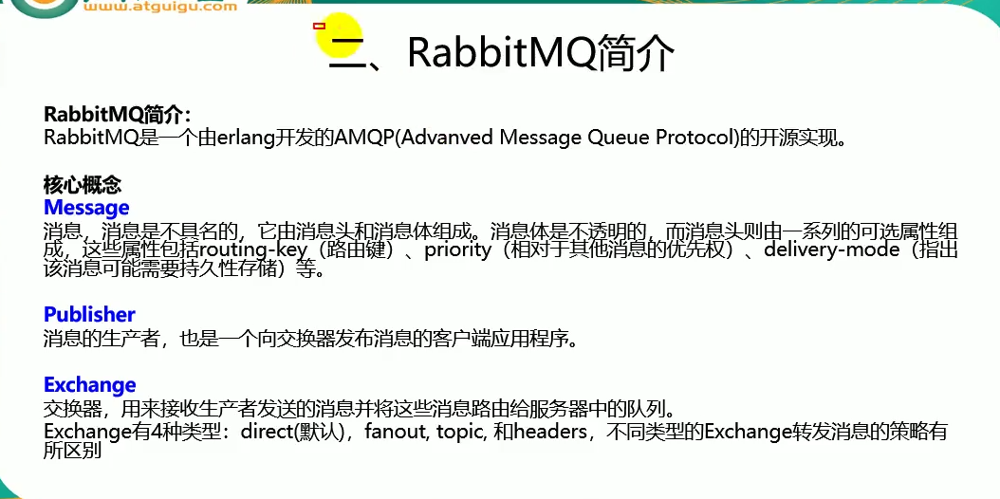
>    >
>    >  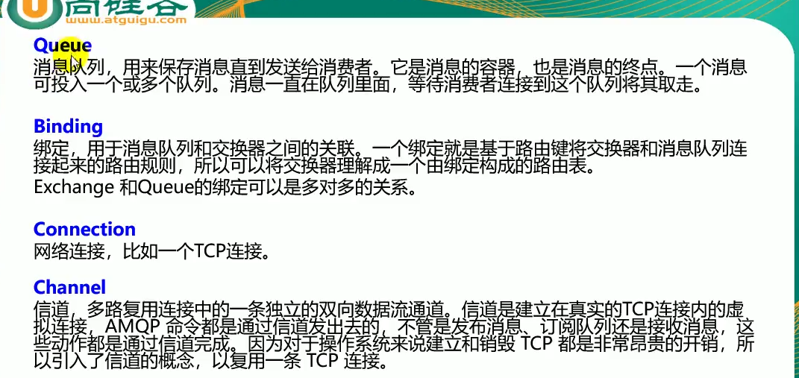
>    >
>    >  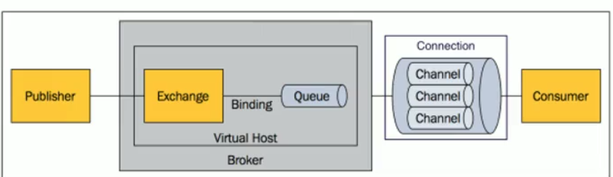
>    >
>    >  交换器和队列是多对多关系
>    >
>    >  * 5672服务端口, 15672 web页面管理端口
>    >
>    >  * RabbitTemplate: 给rabbitQM发送和接受消息
>    >
>    >    > ```java
>    >    > rabbitTemplate.receive();
>    >    > rabbitTemplate.convertAndSend()
>    >    > ```
>    >
>    >  * AmqpAdmin: rabbitmq系统管理功能组件
>    >
>    >    > amqpAdmin.declarexxx()    创建
>
> #### 13. elasticSearch
>
> > port: 9200
> >
> > Restful curd
> >
> > ```http
> > get localhost:9200/megacorp/employee/1
> > put localhost:9200/megacorp/employee/1 
> > ```
> >
> > megacorp 类似于索引库index, employee类似于字段filed, 1为keyword
>
> #### 14. 异步任务、定时任务、邮件任务
>
> > @EnableAsync
> >
> > @Async  异步方法
> >
> > ---
> >
> > @Schedule
> >
> > >  cron = "时间表达式"
> > >
> > > 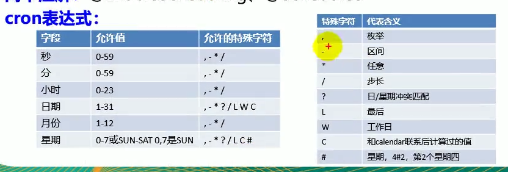
> >
> > @EnableScheduling
> >
> > ---
> >
> > spring-boot-starter-mail
> >
> > 使用JavaMailSender发送message
> >
> > ```yaml
> > spring:
> > mail:
> >  username: 
> >  password:
> >  host:
> >  properties:
> >    mail:
> >      smtp:
> >        ssl:
> >          enable: true
> > ```
> >
> > 简单邮件
> >
> > ```java
> > SimpleMailMessage msg = new SimpleMailMessage();
> > msg.setSubject("xxx");
> > msg.setText("xxx");
> > msg.setTo("xxx@qq.com");
> > msg.setFrom("xxxx@qq.com");
> > mailSender.send(msg);
> > ```
> >
> > 复杂邮件　
> >
> > ```java
> > MimeMessage mimeMsg = mailSender.createMimeMessage();
> > MimeMessageHelper helper = new MimeMessageHelper(mimeMsg, true);
> > helper.setxxx();
> > // ....
> > helper.addAttachement(); //发送附件
> > mailSender.send(mimeMsg);
> > ```
> >
> > 

 