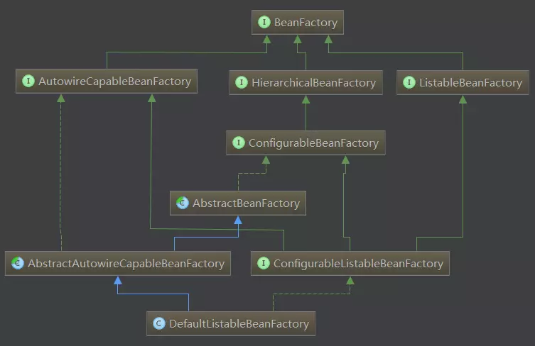

# Spring

@Bean("别名")

@Conditional({<? extends Condition>}) 按条件给容器注册类

#### 容器

`org.springframework.context.ApplicationContext`是Spring IoC容器实现的代表，它负责实例化，配置和组装Bean。容器通过读取配置元数据获取有关实例化、配置和组装哪些对象的说明 。配置元数据可以使用XML、Java注解或Java代码来呈现。它允许你处理应用程序的对象与其他对象之间的互相依赖关系。

Spring提供了`ApplicationContext`接口的几个实现。 在独立应用程序中，通常创建[`ClassPathXmlApplicationContext`](https://docs.spring.io/spring-framework/docs/5.1.3.BUILD-SNAPSHOT/javadoc-api/org/springframework/context/support/ClassPathXmlApplicationContext.html)或[`FileSystemXmlApplicationContext`](https://docs.spring.io/spring-framework/docs/5.1.3.BUILD-SNAPSHOT/javadoc-api/org/springframework/context/support/FileSystemXmlApplicationContext.html)的实例。虽然XML一直是定义配置元数据的传统格式， 但是您可以指定容器使用Java注解或编程的方式编写元数据格式，并通过提供少量的XML配置以声明对某些额外元数据的支持。

##### BeanFactory



> 接口介绍：
>
> **1.BeanFactory接口：**
>  是Spring bean容器的根接口，提供获取bean，是否包含bean,是否单例与原型，获取bean类型，bean 别名的方法 。它最主要的方法就是getBean(String beanName)。
>  **2.BeanFactory的三个子接口：**
>  * HierarchicalBeanFactory：提供父容器的访问功能
>  * ListableBeanFactory：提供了批量获取Bean的方法
>  * AutowireCapableBeanFactory：在BeanFactory基础上实现对已存在实例的管理
>  **3.ConfigurableBeanFactory：**
>  主要单例bean的注册，生成实例，以及统计单例bean
>  **4.ConfigurableListableBeanFactory：**
>  继承了上述的所有接口，增加了其他功能：比如类加载器,类型转化,属性编辑器,BeanPostProcessor,作用域,bean定义,处理bean依赖关系, bean如何销毁…
>  **5.实现类DefaultListableBeanFactory[详细介绍](https://www.cnblogs.com/sten/p/5758161.html)：**
>  实现了ConfigurableListableBeanFactory，实现上述BeanFactory所有功能。它还可以注册BeanDefinition
>  接口详细介绍请参考:[揭秘BeanFactory](https://blog.csdn.net/u011179993/article/details/51636742)

##### ApplicationContext

如果说BeanFactory是Sping的心脏，那么ApplicationContext就是完整的身躯了。


| ApplicationContext常用实现类          | 作用                                                         |
| :------------------------------------ | :----------------------------------------------------------- |
| AnnotationConfigApplicationContext    | 从一个或多个基于java的配置类中加载上下文定义，适用于java注解的方式。 |
| ClassPathXmlApplicationContext        | 从类路径下的一个或多个xml配置文件中加载上下文定义，适用于xml配置的方式。 |
| FileSystemXmlApplicationContext       | 从文件系统下的一个或多个xml配置文件中加载上下文定义，也就是说系统盘符中加载xml配置文件。 |
| AnnotationConfigWebApplicationContext | 专门为web应用准备的，适用于注解方式。                        |
| XmlWebApplicationContext              | 从web应用下的一个或多个xml配置文件加载上下文定义，适用于xml配置方式。 |

###### AnnotationConfigApplicationContext

```java
	public AnnotationConfigApplicationContext() {
        // super();   没有显示写出, 但是会编译时添加  
		this.reader = new AnnotatedBeanDefinitionReader(this);
		this.scanner = new ClassPathBeanDefinitionScanner(this);
	}

	public AnnotationConfigApplicationContext(DefaultListableBeanFactory beanFactory) {
		super(beanFactory);
		this.reader = new AnnotatedBeanDefinitionReader(this);
		this.scanner = new ClassPathBeanDefinitionScanner(this);
	}

	public AnnotationConfigApplicationContext(Class<?>... componentClasses) {
		this();
		register(componentClasses);
		refresh();
	}

	public AnnotationConfigApplicationContext(String... basePackages) {
		this();       
		scan(basePackages);
		refresh();
	}

	//  AnnotationConfigApplicationContext的父类默认构造函数
	public GenericApplicationContext() {
		this.beanFactory = new DefaultListableBeanFactory();
	}

/**************************************************************************************************/
	@Override
	public void refresh() throws BeansException, IllegalStateException {
		synchronized (this.startupShutdownMonitor) {
			// Prepare this context for refreshing.
			prepareRefresh();

			// Tell the subclass to refresh the internal bean factory.
			ConfigurableListableBeanFactory beanFactory = obtainFreshBeanFactory();

			// Prepare the bean factory for use in this context.
			prepareBeanFactory(beanFactory);

			try {
				// Allows post-processing of the bean factory in context subclasses.
				postProcessBeanFactory(beanFactory);
				
                // 重点关注 扫描类, 处理各种@import
              	// 执行自定义的ProcessBeanFactory
				// Invoke factory processors registered as beans in the context.
				invokeBeanFactoryPostProcessors(beanFactory);          

				// Register bean processors that intercept bean creation.
				registerBeanPostProcessors(beanFactory);

				// Initialize message source for this context.
				initMessageSource();

				// Initialize event multicaster for this context.
				initApplicationEventMulticaster();

				// Initialize other special beans in specific context subclasses.
				onRefresh();

				// Check for listener beans and register them.
				registerListeners();

                // 实例化bean
				// Instantiate all remaining (non-lazy-init) singletons.
				finishBeanFactoryInitialization(beanFactory);

				// Last step: publish corresponding event.
				finishRefresh();
			}

			catch (BeansException ex) {
				if (logger.isWarnEnabled()) {
					logger.warn("Exception encountered during context initialization - " +
							"cancelling refresh attempt: " + ex);
				}

				// Destroy already created singletons to avoid dangling resources.
				destroyBeans();

				// Reset 'active' flag.
				cancelRefresh(ex);

				// Propagate exception to caller.
				throw ex;
			}

			finally {
				// Reset common introspection caches in Spring's core, since we
				// might not ever need metadata for singleton beans anymore...
				resetCommonCaches();
			}
		}
	}
```


###### BeanDefinition

BeanDefinition**描述一个bean实例**，这个bean实例包含了属性值，构造函数的参数值，以及由具体实现提供额进一步信息。


###### BeanFactoryPostProcessor

/dev/sda2: LABEL="repository" UUID="89ddcaf7-a122-4eb1-8023-b6c6ca3c57c6" TYPE="ext4" PARTLABEL="Basic data partition" PARTUUID="ac5d7dde-2857-4a7a-80d4-22ec0335fc77"


---

#### Bean

| Property                 | 对应的章节名                                                 |
| :----------------------- | ------------------------------------------------------------ |
| Class                    | [实例化Bean](https://github.com/DocsHome/spring-docs/blob/master/pages/core/IoC-container.md#beans-factory-class) |
| Name                     | [命名Bean](https://github.com/DocsHome/spring-docs/blob/master/pages/core/IoC-container.md#beans-beanname) |
| Scope                    | [Bean 的作用域](https://github.com/DocsHome/spring-docs/blob/master/pages/core/IoC-container.md#beans-factory-scopes) |
| Constructor arguments    | [依赖注入](https://github.com/DocsHome/spring-docs/blob/master/pages/core/IoC-container.md#beans-factory-collaborators) |
| Properties               | [依赖注入](https://github.com/DocsHome/spring-docs/blob/master/pages/core/IoC-container.md#beans-factory-collaborators) |
| Autowiring mode          | [自动装配](https://github.com/DocsHome/spring-docs/blob/master/pages/core/IoC-container.md#beans-factory-autowire) |
| Lazy initialization mode | [懒加载Bean](https://github.com/DocsHome/spring-docs/blob/master/pages/core/IoC-container.md#beans-factory-lazy-init) |
| Initialization method    | [初始化方法回调](https://github.com/DocsHome/spring-docs/blob/master/pages/core/IoC-container.md#beans-factory-lifecycle-initializingbean) |
| Destruction method       | [销毁方法回调](https://github.com/DocsHome/spring-docs/blob/master/pages/core/IoC-container.md#beans-factory-lifecycle-disposablebean) |

##### 内部类

如果你想配置静态内部类，那么必须使用内部类的二进制名称。

例如，在`com.example`有个`SomeThing`类，这个类里面有个静态内部类`OtherThing`，这种情况下bean定义的class属性应该写作 `com.example.SomeThing$OtherThing

##### 依赖注入

依赖注入主要使用两种方式，一种是[基于构造函数的注入](https://github.com/DocsHome/spring-docs/blob/master/pages/core/IoC-container.md#beans-constructor-injection)，另一种的[基于Setter方法的依赖注入](https://github.com/DocsHome/spring-docs/blob/master/pages/core/IoC-container.md#beans-setter-injection)。

1. 循环依赖

   如果开发者主要使用基于构造函数的依赖注入，那么很有可能出现循环依赖的情况。

   例如：类A在构造函数中依赖于类B的实例，而类B的构造函数又依赖类A的实例。如果这样配置类A和类B相互注入的话，Spring IoC容器会发现这个运行时的循环依赖， 并且抛出`BeanCurrentlyInCreationException`。

   开发者可以选择setter方法来配置依赖注入，这样就不会出现循环依赖的情况。或者根本就不使用基于构造函数的依赖注入，而仅仅使用基于setter方法的依赖注入。 换言之，但是开发者可以将循环依赖配置为基于Setter方法的依赖注入（尽管不推荐这样做）

##### Bean的作用域

| 作用域                                                       | 描述                                                         |
| ------------------------------------------------------------ | ------------------------------------------------------------ |
| [singleton](https://github.com/DocsHome/spring-docs/blob/master/pages/core/IoC-container.md#beans-factory-scopes-singleton) | (默认) 每一Spring IOC容器都拥有唯一的实例对象。              |
| [prototype](https://github.com/DocsHome/spring-docs/blob/master/pages/core/IoC-container.md#beans-factory-scopes-prototype) | 一个Bean定义可以创建任意多个实例对象.                        |
| [request](https://github.com/DocsHome/spring-docs/blob/master/pages/core/IoC-container.md#beans-factory-scopes-request) | 将单个bean定义范围限定为单个HTTP请求的生命周期。 也就是说，每个HTTP请求都有自己的bean实例，它是在单个bean定义的后面创建的。 只有基于Web的Spring `ApplicationContext`的才可用。 |
| [session](https://github.com/DocsHome/spring-docs/blob/master/pages/core/IoC-container.md#beans-factory-scopes-session) | 将单个bean定义范围限定为HTTP `Session`的生命周期。 只有基于Web的Spring `ApplicationContext`的才可用。 |
| [application](https://github.com/DocsHome/spring-docs/blob/master/pages/core/IoC-container.md#beans-factory-scopes-application) | 将单个bean定义范围限定为`ServletContext`的生命周期。 只有基于Web的Spring `ApplicationContext`的才可用。 |
| [websocket](https://github.com/DocsHome/spring-docs/blob/master/pages/web/web.md#websocket-stomp-websocket-scope) | 将单个bean定义范围限定为 `WebSocket`的生命周期。 只有基于Web的Spring `ApplicationContext`的才可用。 |

1. 单例

   单例bean在全局只有一个共享的实例，所有依赖单例bean的场景中，容器返回的都是同一个实例。

   Spring的单例bean概念不同于设计模式（GoF）之中所定义的单例模式。设计模式中的单例模式是将一个对象的作用域硬编码的，一个ClassLoader只能有唯一的一个实例。 而Spring的单例作用域是以容器为前提的，每个容器每个bean只能有一个实例。

2. 原型

   非单例的、原型bean指的是每次请求bean实例时,返回的都是新的对象实例。也就是说，每次注入到另外的bean或者通过调用 `getBean()`方法来获得的bean都是全新的实例。 基于线程安全性的考虑，当bean对象有状态时使用原型作用域，而无状态时则使用单例作用域。

3. request, session, application, websocket

   `request`, `session`, `application`, 和 `websocket`作用域只有在Web中使用Spring的`ApplicationContext`（例如`ClassPathXmlApplicationContext`）的情况下才用得上。 如果在普通的Spring IoC容器，例如ClassPathXmlApplicationContext中使用这些作用域，将会抛出IllegalStateException异常来说明使用了未知的作用域。

##### 自定义bean的特性

你可以实现`InitializingBean` 和 `DisposableBean`接口，让容器里管理Bean的生命周期。容器会在调用`afterPropertiesSet()` 之后和`destroy()`之前会允许bean在初始化和销毁bean时执行某些操作。

JSR-250 `@PostConstruct` 和 `@PreDestroy`注解通常被认为是在现代Spring应用程序中接收生命周期回调的最佳实践。 使用这些注解意味着您的bean不会耦合到特定于Spring的接口。 

Spring团队是不建议开发者使用`InitializingBean`接口，因为这样会将代码耦合到Spring的特殊接口上。他们建议使用[`@PostConstruct`](https://github.com/DocsHome/spring-docs/blob/master/pages/core/IoC-container.md#beans-postconstruct-and-predestroy-annotations) 注解或者指定一个POJO的实现方法， 这会比实现接口更好。

我们建议您不要使用 `DisposableBean` 回调接口，因为它会不必要地将代码耦合到Spring。或者，我们建议使用[`@PreDestroy`](https://github.com/DocsHome/spring-docs/blob/master/pages/core/IoC-container.md#beans-postconstruct-and-predestroy-annotations)注解 或指定bean定义支持的泛型方法。 

##### 注解

使用`AnnotationConfigApplicationContext`初始化容器

```java
public static void main(String[] args) {
    // AppConfig是Configuration注解了的类
    AnnotationConfigApplicationContext ctx = new AnnotationConfigApplicationContext(AppConfig.class, MyServiceImpl.class);   
    // 注册其他Bean, Component
    ctx.register( OtherConfig.class);
    ctx.scan("com.exmple");
    ctx.refresh();
    MyService myService = ctx.getBean(MyService.class);
    myService.doStuff();
}
```


1. @Require

   `@Required`注解适用于bean属性setter方法

   此注解仅表示受影响的bean属性必须在配置时通过bean定义中的显式赋值或自动注入值。如果受影响的bean属性尚未指定值，容器将抛出异常；这导致及时的、明确的失败，避免在运行后再抛出`NullPointerException`或类似的异常。 

2. @Autowired

   可以在构造器, setter, field, method等

   默认情况下，当没有候选的bean可用时，自动注入将会失败

3. @Primary

   由于按类型的自动注入可能匹配到多个候选者，所以通常需要对选择过程添加更多的约束。使用Spring的`@Primary`注解是实现这个约束的一种方法。 它表示如果存在多个候选者且另一个bean只需要一个特定类型的bean依赖时，就明确使用标记有`@Primary`注解的那个依赖。如果候选中只有一个"Primary" bean，那么它就是自动注入的值

4. @Qualifiers

   `@Primary` 是一种用于解决自动装配多个值的注入的有效的方法，当需要对选择过程做更多的约束时，可以使用Spring的`@Qualifier`注解，可以为指定的参数绑定限定的值。 缩小类型匹配集，以便为每个参数选择特定的bean。(指定需要注入的bean的id)

5. `@PostConstruct` 和 `@PreDestroy`

   初始化回调函数和销毁回调函数

   **依赖javax.annotation包**

6.  `@Component`, `@Service`,`@Repository` 和`@Controller`

7.  `@Configuration`, `@ComponentScan`

   `@ComponentScan` 要扫描的包

   使用`<context:component-scan>`隐式启用`<context:annotation-config>`

8. @Bean

   在`@Component`中，**不会使用CGLIB增强去拦截方法和属性的调用**。在`@Configuration`注解的类中， `@Bean`注解创建的bean对象**会使用CGLIB代理对方法和属性进行调用**。方法的调用不是常规的Java语法，而是通过容器来提供通用的生命周期管理和代理Spring bean， 甚至在通过编程的方式调用`@Bean`方法时也会产生对其它bean的引用。相比之下，在一个简单的`@Component`类中调用`@Bean`方法中的方法或字段具有标准Java语义，这里没有用到特殊的CGLIB处理或其他约束。

   `@Bean`方法也可以用在父类中，同样适用于Java 8接口中的默认方法。这使得组建复杂的配置时能具有更好的灵活性，甚至可能通过Java 8的默认方法实现多重继承。 这种特性在Spring 4.2开始支持。

   ```java
   @Configuration
   public class AppConfig {
   
       @Bean
       public MyService myService() {
           return new MyServiceImpl();
       }
       
       // BeanOne内有init()的初始化回调函数
       @Bean(initMethod = "init")
       public BeanOne beanOne() {
           return new BeanOne();
       }
       
       @Bean(destroyMethod = "cleanup")
       public BeanTwo beanTwo() {
           return new BeanTwo();
       }
   }
   ```
   
9.  `@PropertySource`

    `@PropertySource`注解提供了便捷的方式，用于增加`PropertySource`到Spring的 `Environment`中。

   给定一个名为`app.properties`的文件，其中包含键值对`testbean.name=myTestBean`， 以下`@Configuration`类使用`@PropertySource`，以便调用`testBean.getName()` 返回`myTestBean`：

   ```java
   @Configuration
   @PropertySource("classpath:/com/myco/app.properties")
   public class AppConfig {
   
       @Autowired
       Environment env;
   
       @Bean
       public TestBean testBean() {
           TestBean testBean = new TestBean();
           testBean.setName(env.getProperty("testbean.name"));
           return testBean;
       }
   }
   ```

---

#### 资源

##### 资源接口

Spring的`Resource`接口的目标是成为一个更强大的接口，用于抽象对底层资源的访问。 以下清单显示了`Resource`接口定义：

```java
public interface Resource extends InputStreamSource {

    boolean exists();

    boolean isOpen();

    URL getURL() throws IOException;

    File getFile() throws IOException;

    Resource createRelative(String relativePath) throws IOException;

    String getFilename();

    String getDescription();

}

public interface InputStreamSource {

    InputStream getInputStream() throws IOException;

}
```

##### 实现

1. UrlResource

   `UrlResource` 封装了`java.net.URL`用来访问正常URL的任意对象。例如`file:` ，HTTP目标，FTP目标等。所有的URL都可以用标准化的字符串来表示，例如通过正确的标准化前缀。 可以用来表示当前URL的类型。 这包括`file:`，用于访问文件系统路径，`http:` ：用于通过HTTP协议访问资源，`ftp:`：用于通过FTP访问资源，以及其他。

   通过java代码可以显式地使用`UrlResource`构造函数来创建`UrlResource`，但也可以调用API方法来使用代表路径的String参数来隐式创建`UrlResource`。 对于后一种情况，JavaBeans `PropertyEditor`最终决定要创建哪种类型的`Resource`。如果路径字符串包含众所周知的（对于它，那么）前缀（例如 `classpath:`:)，它会为该前缀创建适当的专用`Resource`。 但是，如果它无法识别前缀，则假定该字符串是标准URL字符串并创建`UrlResource`。

2. ClassPathResource

   ClassPathResource代表从类路径中获取资源，它使用线程上下文加载器，指定类加载器或给定class类来加载资源

3. FileSystemResource

   `FileSystemResource`是用于处理`java.io.File`和`java.nio.file.Path`的实现，显然，它同时能解析作为`File`和作为`URL`的资源

4. ServletContextResource

   这是`ServletContext`资源的 `Resource`实现，用于解释相关Web应用程序根目录中的相对路径。

5. InputStreamResource

   `InputStreamResource`是针对`InputStream`提供的`Resource`实现。在一般情况下，如果确实无法找到合适的`Resource`实现时，才去使用它。 同时请优先选择`ByteArrayResource`或其他基于文件的`Resource`实现，迫不得已的才使用它。

6. ByteArrayResource

   这是给定字节数组的`Resource`实现。 它为给定的字节数组创建一个`ByteArrayInputStream`。

   当需要从字节数组加载内容时，ByteArrayResource会是个不错的选择，无需求助于单独使用的`InputStreamResource`

| 前缀       | 示例                             | 解释                                                         |
| ---------- | -------------------------------- | ------------------------------------------------------------ |
| classpath: | `classpath:com/myapp/config.xml` | 从类路径加载                                                 |
| file:      | file:///data/config.xml          | 从文件系统加载为`URL`。 另请参见[`FileSystemResource` 警告。](https://github.com/DocsHome/spring-docs/blob/master/pages/core/resources.md#resources-filesystemresource-caveats) |
| http:      | http://myserver/logo.png         | 作为`URL`加载。                                              |
| (none)     | `/data/config.xml`               | 取决于底层的`ApplicationContext`。                           |