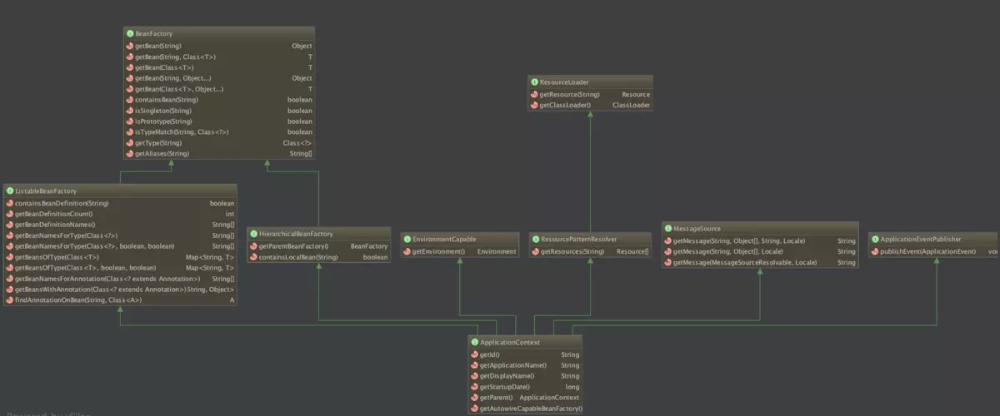

# Spring

@Bean("别名")

@Conditional({<? extends Condition>}) 按条件给容器注册类

#### 容器

`org.springframework.context.ApplicationContext`是Spring IoC容器实现的代表，它负责实例化，配置和组装Bean。容器通过读取配置元数据获取有关实例化、配置和组装哪些对象的说明 。配置元数据可以使用XML、Java注解或Java代码来呈现。它允许你处理应用程序的对象与其他对象之间的互相依赖关系。

Spring提供了`ApplicationContext`接口的几个实现。 在独立应用程序中，通常创建[`ClassPathXmlApplicationContext`](https://docs.spring.io/spring-framework/docs/5.1.3.BUILD-SNAPSHOT/javadoc-api/org/springframework/context/support/ClassPathXmlApplicationContext.html)或[`FileSystemXmlApplicationContext`](https://docs.spring.io/spring-framework/docs/5.1.3.BUILD-SNAPSHOT/javadoc-api/org/springframework/context/support/FileSystemXmlApplicationContext.html)的实例。虽然XML一直是定义配置元数据的传统格式， 但是您可以指定容器使用Java注解或编程的方式编写元数据格式，并通过提供少量的XML配置以声明对某些额外元数据的支持。

##### BeanFactory


> 接口介绍：
>
> **1.BeanFactory接口：**
>  是Spring bean容器的根接口，提供获取bean，是否包含bean,是否单例与原型，获取bean类型，bean 别名的方法 。它最主要的方法就是getBean(String beanName)。
>  **2.BeanFactory的三个子接口：**
>  * HierarchicalBeanFactory：提供父容器的访问功能
>  * ListableBeanFactory：提供了批量获取Bean的方法
>  * AutowireCapableBeanFactory：在BeanFactory基础上实现对已存在实例的管理
>  **3.ConfigurableBeanFactory：**
>  主要单例bean的注册，生成实例，以及统计单例bean
>  **4.ConfigurableListableBeanFactory：**
>  继承了上述的所有接口，增加了其他功能：比如类加载器,类型转化,属性编辑器,BeanPostProcessor,作用域,bean定义,处理bean依赖关系, bean如何销毁…
>  **5.实现类DefaultListableBeanFactory[详细介绍](https://www.cnblogs.com/sten/p/5758161.html)：**
>  实现了ConfigurableListableBeanFactory，实现上述BeanFactory所有功能。它还可以注册BeanDefinition
>  接口详细介绍请参考:[揭秘BeanFactory](https://blog.csdn.net/u011179993/article/details/51636742)

##### ApplicationContext

如果说BeanFactory是Sping的心脏，那么ApplicationContext就是完整的身躯了。



| ApplicationContext常用实现类          | 作用                                                         |
| :------------------------------------ | :----------------------------------------------------------- |
| AnnotationConfigApplicationContext    | 从一个或多个基于java的配置类中加载上下文定义，适用于java注解的方式。 |
| ClassPathXmlApplicationContext        | 从类路径下的一个或多个xml配置文件中加载上下文定义，适用于xml配置的方式。 |
| FileSystemXmlApplicationContext       | 从文件系统下的一个或多个xml配置文件中加载上下文定义，也就是说系统盘符中加载xml配置文件。 |
| AnnotationConfigWebApplicationContext | 专门为web应用准备的，适用于注解方式。                        |
| XmlWebApplicationContext              | 从web应用下的一个或多个xml配置文件加载上下文定义，适用于xml配置方式。 |

###### AnnotationConfigApplicationContext

```java
	public AnnotationConfigApplicationContext() {
        // super();   没有显示写出, 但是会编译时添加  
		this.reader = new AnnotatedBeanDefinitionReader(this);
		this.scanner = new ClassPathBeanDefinitionScanner(this);
	}

	public AnnotationConfigApplicationContext(DefaultListableBeanFactory beanFactory) {
		super(beanFactory);
		this.reader = new AnnotatedBeanDefinitionReader(this);
		this.scanner = new ClassPathBeanDefinitionScanner(this);
	}

	public AnnotationConfigApplicationContext(Class<?>... componentClasses) {
		this();
		register(componentClasses);
		refresh();
	}

	public AnnotationConfigApplicationContext(String... basePackages) {
		this();       
		scan(basePackages);
		refresh();
	}

	//  AnnotationConfigApplicationContext的父类默认构造函数
	public GenericApplicationContext() {
		this.beanFactory = new DefaultListableBeanFactory();
	}

/**************************************************************************************************/
	@Override
	public void refresh() throws BeansException, IllegalStateException {
		synchronized (this.startupShutdownMonitor) {
			// Prepare this context for refreshing.
			prepareRefresh();

			// Tell the subclass to refresh the internal bean factory.
			ConfigurableListableBeanFactory beanFactory = obtainFreshBeanFactory();

			// Prepare the bean factory for use in this context.
			prepareBeanFactory(beanFactory);

			try {
				// Allows post-processing of the bean factory in context subclasses.
				postProcessBeanFactory(beanFactory);
				
                // 重点关注 扫描类, 处理各种@import
              	// 执行自定义的ProcessBeanFactory
				// Invoke factory processors registered as beans in the context.
				invokeBeanFactoryPostProcessors(beanFactory);          

				// Register bean processors that intercept bean creation.
				registerBeanPostProcessors(beanFactory);

				// Initialize message source for this context.
				initMessageSource();

				// Initialize event multicaster for this context.
				initApplicationEventMulticaster();

				// Initialize other special beans in specific context subclasses.
				onRefresh();

				// Check for listener beans and register them.
				registerListeners();

                // 实例化bean
				// Instantiate all remaining (non-lazy-init) singletons.
				finishBeanFactoryInitialization(beanFactory);

				// Last step: publish corresponding event.
				finishRefresh();
			}

			catch (BeansException ex) {
				if (logger.isWarnEnabled()) {
					logger.warn("Exception encountered during context initialization - " +
							"cancelling refresh attempt: " + ex);
				}

				// Destroy already created singletons to avoid dangling resources.
				destroyBeans();

				// Reset 'active' flag.
				cancelRefresh(ex);

				// Propagate exception to caller.
				throw ex;
			}

			finally {
				// Reset common introspection caches in Spring's core, since we
				// might not ever need metadata for singleton beans anymore...
				resetCommonCaches();
			}
		}
	}
```


###### BeanDefinition

BeanDefinition**描述一个bean实例**，这个bean实例包含了属性值，构造函数的参数值，以及由具体实现提供额进一步信息。


###### BeanFactoryPostProcessor

/dev/sda2: LABEL="repository" UUID="89ddcaf7-a122-4eb1-8023-b6c6ca3c57c6" TYPE="ext4" PARTLABEL="Basic data partition" PARTUUID="ac5d7dde-2857-4a7a-80d4-22ec0335fc77"


---

#### Bean

| Property                 | 对应的章节名                                                 |
| :----------------------- | ------------------------------------------------------------ |
| Class                    | [实例化Bean](https://github.com/DocsHome/spring-docs/blob/master/pages/core/IoC-container.md#beans-factory-class) |
| Name                     | [命名Bean](https://github.com/DocsHome/spring-docs/blob/master/pages/core/IoC-container.md#beans-beanname) |
| Scope                    | [Bean 的作用域](https://github.com/DocsHome/spring-docs/blob/master/pages/core/IoC-container.md#beans-factory-scopes) |
| Constructor arguments    | [依赖注入](https://github.com/DocsHome/spring-docs/blob/master/pages/core/IoC-container.md#beans-factory-collaborators) |
| Properties               | [依赖注入](https://github.com/DocsHome/spring-docs/blob/master/pages/core/IoC-container.md#beans-factory-collaborators) |
| Autowiring mode          | [自动装配](https://github.com/DocsHome/spring-docs/blob/master/pages/core/IoC-container.md#beans-factory-autowire) |
| Lazy initialization mode | [懒加载Bean](https://github.com/DocsHome/spring-docs/blob/master/pages/core/IoC-container.md#beans-factory-lazy-init) |
| Initialization method    | [初始化方法回调](https://github.com/DocsHome/spring-docs/blob/master/pages/core/IoC-container.md#beans-factory-lifecycle-initializingbean) |
| Destruction method       | [销毁方法回调](https://github.com/DocsHome/spring-docs/blob/master/pages/core/IoC-container.md#beans-factory-lifecycle-disposablebean) |

##### 内部类

如果你想配置静态内部类，那么必须使用内部类的二进制名称。

例如，在`com.example`有个`SomeThing`类，这个类里面有个静态内部类`OtherThing`，这种情况下bean定义的class属性应该写作 `com.example.SomeThing$OtherThing

##### 依赖注入

依赖注入主要使用两种方式，一种是[基于构造函数的注入](https://github.com/DocsHome/spring-docs/blob/master/pages/core/IoC-container.md#beans-constructor-injection)，另一种的[基于Setter方法的依赖注入](https://github.com/DocsHome/spring-docs/blob/master/pages/core/IoC-container.md#beans-setter-injection)。

1. 循环依赖

   如果开发者主要使用基于构造函数的依赖注入，那么很有可能出现循环依赖的情况。

   例如：类A在构造函数中依赖于类B的实例，而类B的构造函数又依赖类A的实例。如果这样配置类A和类B相互注入的话，Spring IoC容器会发现这个运行时的循环依赖， 并且抛出`BeanCurrentlyInCreationException`。

   开发者可以选择setter方法来配置依赖注入，这样就不会出现循环依赖的情况。或者根本就不使用基于构造函数的依赖注入，而仅仅使用基于setter方法的依赖注入。 换言之，但是开发者可以将循环依赖配置为基于Setter方法的依赖注入（尽管不推荐这样做）

##### Bean的作用域

| 作用域                                                       | 描述                                                         |
| ------------------------------------------------------------ | ------------------------------------------------------------ |
| [singleton](https://github.com/DocsHome/spring-docs/blob/master/pages/core/IoC-container.md#beans-factory-scopes-singleton) | (默认) 每一Spring IOC容器都拥有唯一的实例对象。              |
| [prototype](https://github.com/DocsHome/spring-docs/blob/master/pages/core/IoC-container.md#beans-factory-scopes-prototype) | 一个Bean定义可以创建任意多个实例对象.                        |
| [request](https://github.com/DocsHome/spring-docs/blob/master/pages/core/IoC-container.md#beans-factory-scopes-request) | 将单个bean定义范围限定为单个HTTP请求的生命周期。 也就是说，每个HTTP请求都有自己的bean实例，它是在单个bean定义的后面创建的。 只有基于Web的Spring `ApplicationContext`的才可用。 |
| [session](https://github.com/DocsHome/spring-docs/blob/master/pages/core/IoC-container.md#beans-factory-scopes-session) | 将单个bean定义范围限定为HTTP `Session`的生命周期。 只有基于Web的Spring `ApplicationContext`的才可用。 |
| [application](https://github.com/DocsHome/spring-docs/blob/master/pages/core/IoC-container.md#beans-factory-scopes-application) | 将单个bean定义范围限定为`ServletContext`的生命周期。 只有基于Web的Spring `ApplicationContext`的才可用。 |
| [websocket](https://github.com/DocsHome/spring-docs/blob/master/pages/web/web.md#websocket-stomp-websocket-scope) | 将单个bean定义范围限定为 `WebSocket`的生命周期。 只有基于Web的Spring `ApplicationContext`的才可用。 |

1. 单例

   单例bean在全局只有一个共享的实例，所有依赖单例bean的场景中，容器返回的都是同一个实例。

   Spring的单例bean概念不同于设计模式（GoF）之中所定义的单例模式。设计模式中的单例模式是将一个对象的作用域硬编码的，一个ClassLoader只能有唯一的一个实例。 而Spring的单例作用域是以容器为前提的，每个容器每个bean只能有一个实例。

2. 原型

   非单例的、原型bean指的是每次请求bean实例时,返回的都是新的对象实例。也就是说，每次注入到另外的bean或者通过调用 `getBean()`方法来获得的bean都是全新的实例。 基于线程安全性的考虑，当bean对象有状态时使用原型作用域，而无状态时则使用单例作用域。

3. request, session, application, websocket

   `request`, `session`, `application`, 和 `websocket`作用域只有在Web中使用Spring的`ApplicationContext`（例如`ClassPathXmlApplicationContext`）的情况下才用得上。 如果在普通的Spring IoC容器，例如ClassPathXmlApplicationContext中使用这些作用域，将会抛出IllegalStateException异常来说明使用了未知的作用域。

##### 自定义bean的特性

你可以实现`InitializingBean` 和 `DisposableBean`接口，让容器里管理Bean的生命周期。容器会在调用`afterPropertiesSet()` 之后和`destroy()`之前会允许bean在初始化和销毁bean时执行某些操作。

JSR-250 `@PostConstruct` 和 `@PreDestroy`注解通常被认为是在现代Spring应用程序中接收生命周期回调的最佳实践。 使用这些注解意味着您的bean不会耦合到特定于Spring的接口。 

Spring团队是不建议开发者使用`InitializingBean`接口，因为这样会将代码耦合到Spring的特殊接口上。他们建议使用[`@PostConstruct`](https://github.com/DocsHome/spring-docs/blob/master/pages/core/IoC-container.md#beans-postconstruct-and-predestroy-annotations) 注解或者指定一个POJO的实现方法， 这会比实现接口更好。

我们建议您不要使用 `DisposableBean` 回调接口，因为它会不必要地将代码耦合到Spring。或者，我们建议使用[`@PreDestroy`](https://github.com/DocsHome/spring-docs/blob/master/pages/core/IoC-container.md#beans-postconstruct-and-predestroy-annotations)注解 或指定bean定义支持的泛型方法。 

##### 注解

使用`AnnotationConfigApplicationContext`初始化容器

```java
public static void main(String[] args) {
    // AppConfig是Configuration注解了的类
    AnnotationConfigApplicationContext ctx = new AnnotationConfigApplicationContext(AppConfig.class, MyServiceImpl.class);   
    // 注册其他Bean, Component
    ctx.register( OtherConfig.class);
    ctx.scan("com.exmple");
    ctx.refresh();
    MyService myService = ctx.getBean(MyService.class);
    myService.doStuff();
}
```


1. @Require

   `@Required`注解适用于bean属性setter方法

   此注解仅表示受影响的bean属性必须在配置时通过bean定义中的显式赋值或自动注入值。如果受影响的bean属性尚未指定值，容器将抛出异常；这导致及时的、明确的失败，避免在运行后再抛出`NullPointerException`或类似的异常。 

2. @Autowired

   可以在构造器, setter, field, method等

   默认情况下，当没有候选的bean可用时，自动注入将会失败

3. @Primary

   由于按类型的自动注入可能匹配到多个候选者，所以通常需要对选择过程添加更多的约束。使用Spring的`@Primary`注解是实现这个约束的一种方法。 它表示如果存在多个候选者且另一个bean只需要一个特定类型的bean依赖时，就明确使用标记有`@Primary`注解的那个依赖。如果候选中只有一个"Primary" bean，那么它就是自动注入的值

4. @Qualifiers

   `@Primary` 是一种用于解决自动装配多个值的注入的有效的方法，当需要对选择过程做更多的约束时，可以使用Spring的`@Qualifier`注解，可以为指定的参数绑定限定的值。 缩小类型匹配集，以便为每个参数选择特定的bean。(指定需要注入的bean的id)

5. `@PostConstruct` 和 `@PreDestroy`

   初始化回调函数和销毁回调函数

   **依赖javax.annotation包**

6.  `@Component`, `@Service`,`@Repository` 和`@Controller`

7.  `@Configuration`, `@ComponentScan`

   `@ComponentScan` 要扫描的包

   使用`<context:component-scan>`隐式启用`<context:annotation-config>`

8. @Bean

   在`@Component`中，**不会使用CGLIB增强去拦截方法和属性的调用**。在`@Configuration`注解的类中， `@Bean`注解创建的bean对象**会使用CGLIB代理对方法和属性进行调用**。方法的调用不是常规的Java语法，而是通过容器来提供通用的生命周期管理和代理Spring bean， 甚至在通过编程的方式调用`@Bean`方法时也会产生对其它bean的引用。相比之下，在一个简单的`@Component`类中调用`@Bean`方法中的方法或字段具有标准Java语义，这里没有用到特殊的CGLIB处理或其他约束。

   `@Bean`方法也可以用在父类中，同样适用于Java 8接口中的默认方法。这使得组建复杂的配置时能具有更好的灵活性，甚至可能通过Java 8的默认方法实现多重继承。 这种特性在Spring 4.2开始支持。

   ```java
   @Configuration
   public class AppConfig {
   
       @Bean
       public MyService myService() {
           return new MyServiceImpl();
       }
       
       // BeanOne内有init()的初始化回调函数
       @Bean(initMethod = "init")
       public BeanOne beanOne() {
           return new BeanOne();
       }
       
       @Bean(destroyMethod = "cleanup")
       public BeanTwo beanTwo() {
           return new BeanTwo();
       }
   }
   ```
   
9.  `@PropertySource`

    `@PropertySource`注解提供了便捷的方式，用于增加`PropertySource`到Spring的 `Environment`中。

   给定一个名为`app.properties`的文件，其中包含键值对`testbean.name=myTestBean`， 以下`@Configuration`类使用`@PropertySource`，以便调用`testBean.getName()` 返回`myTestBean`：

   ```java
   @Configuration
   @PropertySource("classpath:/com/myco/app.properties")
   public class AppConfig {
   
       @Autowired
       Environment env;
   
       @Bean
       public TestBean testBean() {
           TestBean testBean = new TestBean();
           testBean.setName(env.getProperty("testbean.name"));
           return testBean;
       }
   }
   ```
   
10. @Conditional

    ```java
    @Target({ElementType.TYPE, ElementType.METHOD})
    @Retention(RetentionPolicy.RUNTIME)
    @Documented
    public @interface Conditional {
    	Class<? extends Condition>[] value();
    }
    
    @FunctionalInterface
    public interface Condition {
    	boolean matches(ConditionContext context, AnnotatedTypeMetadata metadata);
    }
    ```

    

11. 

---

#### 资源

##### 资源接口

Spring的`Resource`接口的目标是成为一个更强大的接口，用于抽象对底层资源的访问。 以下清单显示了`Resource`接口定义：

```java
public interface Resource extends InputStreamSource {

    boolean exists();

    boolean isOpen();

    URL getURL() throws IOException;

    File getFile() throws IOException;

    Resource createRelative(String relativePath) throws IOException;

    String getFilename();

    String getDescription();

}

public interface InputStreamSource {

    InputStream getInputStream() throws IOException;

}
```

##### 实现

1. UrlResource

   `UrlResource` 封装了`java.net.URL`用来访问正常URL的任意对象。例如`file:` ，HTTP目标，FTP目标等。所有的URL都可以用标准化的字符串来表示，例如通过正确的标准化前缀。 可以用来表示当前URL的类型。 这包括`file:`，用于访问文件系统路径，`http:` ：用于通过HTTP协议访问资源，`ftp:`：用于通过FTP访问资源，以及其他。

   通过java代码可以显式地使用`UrlResource`构造函数来创建`UrlResource`，但也可以调用API方法来使用代表路径的String参数来隐式创建`UrlResource`。 对于后一种情况，JavaBeans `PropertyEditor`最终决定要创建哪种类型的`Resource`。如果路径字符串包含众所周知的（对于它，那么）前缀（例如 `classpath:`:)，它会为该前缀创建适当的专用`Resource`。 但是，如果它无法识别前缀，则假定该字符串是标准URL字符串并创建`UrlResource`。

2. ClassPathResource

   ClassPathResource代表从类路径中获取资源，它使用线程上下文加载器，指定类加载器或给定class类来加载资源

3. FileSystemResource

   `FileSystemResource`是用于处理`java.io.File`和`java.nio.file.Path`的实现，显然，它同时能解析作为`File`和作为`URL`的资源

4. ServletContextResource

   这是`ServletContext`资源的 `Resource`实现，用于解释相关Web应用程序根目录中的相对路径。

5. InputStreamResource

   `InputStreamResource`是针对`InputStream`提供的`Resource`实现。在一般情况下，如果确实无法找到合适的`Resource`实现时，才去使用它。 同时请优先选择`ByteArrayResource`或其他基于文件的`Resource`实现，迫不得已的才使用它。

6. ByteArrayResource

   这是给定字节数组的`Resource`实现。 它为给定的字节数组创建一个`ByteArrayInputStream`。

   当需要从字节数组加载内容时，ByteArrayResource会是个不错的选择，无需求助于单独使用的`InputStreamResource`

| 前缀       | 示例                             | 解释                                                         |
| ---------- | -------------------------------- | ------------------------------------------------------------ |
| classpath: | `classpath:com/myapp/config.xml` | 从类路径加载                                                 |
| file:      | file:///data/config.xml          | 从文件系统加载为`URL`。 另请参见[`FileSystemResource` 警告。](https://github.com/DocsHome/spring-docs/blob/master/pages/core/resources.md#resources-filesystemresource-caveats) |
| http:      | http://myserver/logo.png         | 作为`URL`加载。                                              |
| (none)     | `/data/config.xml`               | 取决于底层的`ApplicationContext`。                           |


---

#### validator, dataBinder

Spring为开发者提供了一个称作`DataBinder`的对象来处理数据绑定，所谓的数据绑定就是将用户输入自动地绑定到相应的领域模型（或者说用来处理用户所输入的任何对象）。Spring的`Validator`和`DataBinder` 构成了验证包，这个包主要用在Spring MVC框架使用，但绝不限于此


##### Validator接口

```java
public interface Validator {

    // 支持验证的class
	boolean supports(Class<?> clazz);

    // 验证给定对象, 如果有失败信息则将其放入errors
	void validate(Object target, Errors errors);
}
```

---

####  

SpEL

表达式语言支持以下功能:

- 文字表达
- 布尔和关系运算符
- 正则表达式
- 类表达式
- 访问属性，数组，list和maps
- 方法调用
- 关系运算符
- 声明
- 调用构造器
- bean的引用
- 数组的构造
- 内嵌的list
- 内嵌的map
- 三元表达式
- 变量
- 用户自定义函数
- 集合映射
- 集合选择
- 模板表达式

---

#### AOP


##### 概念

让我们从定义一些核心AOP概念和术语开始。 这些术语不是特定于Spring的。 不幸的是，AOP术语不是特别直观。 但是，如果Spring使用自己的术语，那将更加令人困惑。

- 切面（Aspect）: 指关注点模块化，这个关注点可能会横切多个对象。事务管理是企业级Java应用中有关横切关注点的例子。 在Spring AOP中，切面可以使用通用类基于模式的方式（schema-based approach）或者在普通类中以`@Aspect`注解来实现。
- 连接点（Join point）: 在程序执行过程中某个特定的点，例如某个方法调用的时间点或者处理异常的时间点。在Spring AOP中，一个连接点总是代表一个方法的执行。
- 通知（Advice）: 在切面的某个特定的连接点上执行的动作。通知有多种类型，包括“around”, “before” and “after”等等。通知的类型将在后面的章节进行讨论。 许多AOP框架，包括Spring在内，都是以拦截器做通知模型的，并维护着一个以连接点为中心的拦截器链。
- 切点（Pointcut）: 匹配连接点的断言。通知和切点表达式相关联，并在满足这个切点的连接点上运行（例如，当执行某个特定名称的方法时）。切点表达式如何和连接点匹配是AOP的核心：Spring默认使用AspectJ切点语义。
- 引入（Introduction）: 声明额外的方法或者某个类型的字段。Spring允许引入新的接口（以及一个对应的实现）到任何被通知的对象上。例如，可以使用引入来使bean实现 `IsModified`接口， 以便简化缓存机制（在AspectJ社区，引入也被称为内部类型声明（inter））。
- 目标对象（Target object）: 被一个或者多个切面所通知的对象。也被称作被通知（advised）对象。既然Spring AOP是通过运行时代理实现的，那么这个对象永远是一个被代理（proxied）的对象。
- AOP代理（AOP proxy）:AOP框架创建的对象，用来实现切面契约（aspect contract）（包括通知方法执行等功能）。在Spring中，AOP代理可以是JDK动态代理或CGLIB代理。
- 织入（Weaving）: 把切面连接到其它的应用程序类型或者对象上，并创建一个被被通知的对象的过程。这个过程可以在编译时（例如使用AspectJ编译器）、类加载时或运行时中完成。 Spring和其他纯Java AOP框架一样，是在运行时完成织入的。


##### Spring AOP的通知

- 前置通知（Before advice）: 在连接点之前运行但无法阻止执行流程进入连接点的通知（除非它引发异常）。
- 后置返回通知（After returning advice）:在连接点正常完成后执行的通知（例如，当方法没有抛出任何异常并正常返回时）。
- 后置异常通知（After throwing advice）: 在方法抛出异常退出时执行的通知。
- 后置通知（总会执行）（After (finally) advice）: 当连接点退出的时候执行的通知（无论是正常返回还是异常退出）。
- 环绕通知（Around Advice）:环绕连接点的通知，例如方法调用。这是最强大的一种通知类型，。环绕通知可以在方法调用前后完成自定义的行为。它可以选择是否继续执行连接点或直接返回自定义的返回值又或抛出异常将执行结束。

Spring目前仅支持方法调用的方式作为连接点

Spring AOP默认使用JDK动态代理, 也支持CGLIB代理.


##### @AspectJ

​    依赖AspectJ Runtime

1. ###### 启用AOP

   ```java
   @Configuration
   @EnableAspectJAutoProxy
   public class AppConfig {
   		// ....
   }
   ```

2. ###### 声明切面

   @Aspect

   ```java
   @Aspect
   @Component    
   public class AspectDemo{
       
       // execution(<修饰符模式>?<返回类型模式><方法名模式>(<参数模式>)<异常模式>?)
       @PointCut("execution(* com.demo.*.*(...))")
       public void logPoint(){}
   }
   ```

   仅使用@Aspect不能时bean注入容器, 需要添加@Component才能被Configuration扫描识别

3. ###### 声明切点

   使用@PointCut标识切点方法和切点

   ##### 支持切点标识符

   Spring AOP支持使用以下AspectJ切点标识符(PCD),用于切点表达式：

   - `execution`: 用于匹配方法执行连接点。 这是使用Spring AOP时使用的主要切点标识符。
   - `within`: 限制匹配特定类型中的连接点（在使用Spring AOP时，只需执行在匹配类型中声明的方法）。
   - `this`: 在bean引用（Spring AOP代理）是给定类型的实例的情况下，限制匹配连接点（使用Spring AOP时方法的执行）。
   - `target`: 限制匹配到连接点（使用Spring AOP时方法的执行），其中目标对象（正在代理的应用程序对象）是给定类型的实例。
   - `args`: 限制与连接点的匹配（使用Spring AOP时方法的执行），其中变量是给定类型的实例。 AOP) where the arguments are instances of the given types.
   - `@target`: 限制与连接点的匹配（使用Spring AOP时方法的执行），其中执行对象的类具有给定类型的注解。
   - `@args`: 限制匹配连接点（使用Spring AOP时方法的执行），其中传递的实际参数的运行时类型具有给定类型的注解。
   - `@within`: 限制与具有给定注解的类型中的连接点匹配（使用Spring AOP时在具有给定注解的类型中声明的方法的执行）。
   - `@annotation`:限制匹配连接点（在Spring AOP中执行的方法具有给定的注解）。

   由于Spring AOP框架是基于代理的特性，**定义的protected方法将不会被处理**，不管是JDK的代理（做不到）还是CGLIB代理（有技术可以实现但是不建议）。 因此，任何给定的切点将只能与public方法匹配。

   请注意，切点定义通常与任何截获的方法匹配。 如果切点严格意义上是公开的，即使在通过代理进行潜在非公共交互的CGLIB代理方案中，也需要相应地定义切点。

   ##### 合并切点表达式

   您可以使用 `&&,` `||` 和 `!`等符号进行合并操作。也可以通过名字来指向切点表达式。 以下示例显示了三个切入点表达式：

   ```
   @Pointcut("execution(public * *(..))")
   private void anyPublicOperation() {}  // (1)
   
   @Pointcut("within(com.xyz.someapp.trading..*)")
   private void inTrading() {}   // (2)
   
   @Pointcut("anyPublicOperation() && inTrading()")
   private void tradingOperation() {}   // (3)
   ```

   **(1)。**`anyPublicOperation`：如果方法执行连接点表示任何公共方法的执行，则匹配

   **(2)。**`inTrading` ：如果方法执行在trading中，则匹配.

   **(3)。**`tradingOperation` ：如果方法执行表示trading中的任何公共方法，则匹配。

   **可以创建一个专门的切点类存放切点**

   以下示例显示了一些常见的切点表达式：

   - 匹配任意公共方法的执行:

     ```java
     execution(public * *(..))
     ```

   - 匹配任意以`set`开始的方法:

     ```java
     execution(* set*(..))
     ```

   - 匹配定义了`AccountService`接口的任意方法:

     ```java
     execution(* com.xyz.service.AccountService.*(..))
     ```

   - 匹配定义在`service` 包中的任意方法:

     ```java
     execution(* com.xyz.service.*.*(..))
     ```

   - 匹配定义在service包和其子包中的任意方法:

     ```java
     execution(* com.xyz.service..*.*(..))
     ```

   - 匹配在service包中的任意连接点（只在Spring AOP中的方法执行）:

     ```java
     within(com.xyz.service.*)
     ```

   - 匹配在service包及其子包中的任意连接点（只在Spring AOP中的方法执行）:

     ```java
     within(com.xyz.service..*)
     ```

   - 匹配代理实现了`AccountService` 接口的任意连接点（只在Spring AOP中的方法执行）：

     ```java
     this(com.xyz.service.AccountService)
     ```

     'this' 常常以捆绑的形式出现. 见后续的章节讨论如何在[声明通知](https://github.com/DocsHome/spring-docs/blob/master/pages/core/aop.md#aop-advice)中使用代理对象。

   - 匹配当目标对象实现了`AccountService`接口的任意连接点（只在Spring AOP中的方法执行）:

     ```java
     target(com.xyz.service.AccountService)
     ```

     'target' 常常以捆绑的形式出现. 见后续的章节讨论如何在[声明通知](https://github.com/DocsHome/spring-docs/blob/master/pages/core/aop.md#aop-advice)中使用目标对象。

   - 匹配使用了单一的参数，并且参数在运行时被传递时可以序列化的任意连接点（只在Spring的AOP中的方法执行）。:

     ```java
     args(java.io.Serializable)
     ```

     'args' 常常以捆绑的形式出现.见后续的章节讨论如何在[声明通知](https://github.com/DocsHome/spring-docs/blob/master/pages/core/aop.md#aop-advice)中使用方法参数。

     注意在这个例子中给定的切点不同于`execution(* *(java.io.Serializable))`. 如果在运行时传递的参数是可序列化的，则与execution匹配，如果方法签名声明单个参数类型可序列化，则与args匹配。

   - 匹配当目标对象有`@Transactional`注解时的任意连接点（只在Spring AOP中的方法执行）。

     ```java
     @target(org.springframework.transaction.annotation.Transactional)
     ```

     '@target' 也可以以捆绑的形式使用.见后续的章节讨论如何在[声明通知](https://github.com/DocsHome/spring-docs/blob/master/pages/core/aop.md#aop-advice)中使用注解对象。

   - 匹配当目标对象的定义类型有`@Transactional`注解时的任意连接点（只在Spring的AOP中的方法执行）:

     ```java
     @within(org.springframework.transaction.annotation.Transactional)
     ```

     '@within' 也可以以捆绑的形式使用.见后续的章节讨论如何在[声明通知](https://github.com/DocsHome/spring-docs/blob/master/pages/core/aop.md#aop-advice)中使用注解对象。

   - 匹配当执行的方法有`@Transactional`注解的任意连接点（只在Spring AOP中的方法执行）:

     ```java
     @annotation(org.springframework.transaction.annotation.Transactional)
     ```

     '@annotation' 也可以以捆绑的形式使用.见后续的章节讨论如何在[声明通知](https://github.com/DocsHome/spring-docs/blob/master/pages/core/aop.md#aop-advice)中使用注解对象。

   - 匹配有单一的参数并且在运行时传入的参数类型有`@Classified`注解的任意连接点（只在Spring AOP中的方法执行）:

     ```java
     @args(com.xyz.security.Classified)
     ```

     '@args' 也可以以捆绑的形式使用.见后续的章节讨论如何在[声明通知](https://github.com/DocsHome/spring-docs/blob/master/pages/core/aop.md#aop-advice)中使用注解对象。

   - 匹配在名为`tradeService`的Spring bean上的任意连接点（只在Spring AOP中的方法执行）:

     ```java
     bean(tradeService)
     ```

   - 匹配以`Service`结尾的Spring bean上的任意连接点（只在Spring AOP中方法执行） :

     ```java
     bean(*Service)
     ```

4. ###### 声明通知

  - @Before

    切点运行前
  
  - @AfterReturning
  
    切点执行返回后
  
    ```java
        @AfterReturning(
            pointcut="com.xyz.myapp.SystemArchitecture.dataAccessOperation()",
            returning="retVal")
        public void doAccessCheck(Object retVal) {
            // ...
        }
    
        @AfterReturning("com.xyz.myapp.SystemArchitecture.dataAccessOperation()")
        public void doAccessCheck() {
            // ...
        }
    ```
  
  - @AfterThrowing
  
    切点抛出异常后
  
    ```java
        @AfterThrowing("com.xyz.myapp.SystemArchitecture.dataAccessOperation()")
        public void doRecoveryActions() {
            // ...
        }
        
        @AfterThrowing(
            pointcut="com.xyz.myapp.SystemArchitecture.dataAccessOperation()",
            throwing="ex")
        public void doRecoveryActions(DataAccessException ex) {
            // ...
        }
    ```
  
  - @After
  
    总会执行
  
  - @Around
  
    使用`@Around`注解来定义环绕通知，第一个参数必须是`ProceedingJoinPoint`类型的。在通知中调用 `ProceedingJoinPoint`中的 `proceed()`方法来引用执行的方法。`proceed`方法也可以被调用传递数组对象- 数组的值将会被当作参数在方法执行时被使用。proceed方法也可以传入 `Object[]`。 数组中的值在进行时用作方法执行的参数。
  
    ```java
        @Around("com.xyz.myapp.SystemArchitecture.businessService()")
        public Object doBasicProfiling(ProceedingJoinPoint pjp) throws Throwable {
            // start stopwatch
            Object retVal = pjp.proceed();
            // stop stopwatch
            return retVal;
        }
    ```
  
    可以在around通知的主体内调用`proceed()`一次，多次或根本不调用。 所有这些都是合法的
    
  
  
##### JoinPoint

任何通知方法都可以声明一个类型为 `org.aspectj.lang.JoinPoint`的参数作为其第一个参数（注意，需要使用around advice来声明一个类型为`ProceedingJoinPoint`的第一个参数， 它是`JoinPoint`的一个子类。`JoinPoint`接口提供很多有用的方法：:

- `getArgs()`: 返回方法参数.
- `getThis()`: 返回代理对象.
- `getTarget()`: 返回目标对象.
- `getSignature()`:返回正在通知的方法的描述.
- `toString()`: 打印方法被通知的有用描述.

```java
public interface JoinPoint {  
   String toString();         //连接点所在位置的相关信息  
   String toShortString();     //连接点所在位置的简短相关信息  
   String toLongString();     //连接点所在位置的全部相关信息  
   Object getThis();         //返回AOP代理对象  
   Object getTarget();       //返回目标对象  
   Object[] getArgs();       //返回被通知方法参数列表  
   Signature getSignature();  //返回当前连接点签名  
   SourceLocation getSourceLocation();//返回连接点方法所在类文件中的位置  
   String getKind();        //连接点类型  
   StaticPart getStaticPart(); //返回连接点静态部分  
  }  
 
 public interface ProceedingJoinPoint extends JoinPoint {  
       public Object proceed() throws Throwable;  
       public Object proceed(Object[] args) throws Throwable;  

```

---


#### 事务

- 默认回滚运行时异常(RuntimeException及其子类, Error实例也会回滚)
- 不会滚编译时异常 (方法上声明了的异常或try/catch了的异常)


##### 并发带来的问题 

假设有两个事务A, B并发执行

1. 脏读   (读了其他事务未提交的数据)    **不能发生**
   * A将某条记录的age从20修改为30
   * B读取到A修改后的数据30
   * A发生异常, 将30回滚为20
   * 这时B读到的30就是无效值
2. 幻读   (多读了或少读了一些数据)
   * A读取了表的一部分数据
   * B向表中插入了新的行
   * A再次读取表时多出了一些行
3. 不可重复读  (读取数据时, 其他事务修改了数据)
   * A读取了age的值为20
   * B将age的值修改为30
   * A再次读取age的值为30, 和第一次读取不一致

##### 事务的隔离级别


1. 读未提交  

2. 读已提交

   A只能读B事务已经提交了了数据

3. 可重复读

   同一事务多次读取时读取的数据一致.  即A执行期间禁止其他事务对数据更新

4. 串行化

   一张表同时只有一个事务执行


##### 传播规则

在一个事务中调用其他事务方法

事务A调用事务B

1. REQUIRED    必须存在一个事务, 如果当前存在一个事务, 则加入该事务, 否则新建一个事务 (使用较多)
2. SUPPORT      支持当前事务, 如果当前存在事务, 则使用事务, 否则不使用事务运行
3. MANDATORY         必须存在事务, 如果当前存在事务, 则使用事务, 否则抛出`IllegalTransactionStateException`
4. REQUIRE_NEW    无论是否存在一个事务, 都会开启一个**新的事务**  (使用较多)
5. NOT_SUPPORT   以非事务方式执行, 如果当前存在事务, 把当前事务挂起(暂停)
6. NEVER        不支持事务, 如果存在事务则抛出异常
7. NESTED     寄生事务, 如果当前存在事务, 则在内部事务执行, 如果当前不存在事务,则创建一个事务


##### PlatformTransactionManager

```java
public interface PlatformTransactionManager extends TransactionManager {
     
    TransactionStatus getTransaction(@Nullable TransactionDefinition var1) throws TransactionException;

    void commit(TransactionStatus var1) throws TransactionException;

    void rollback(TransactionStatus var1) throws TransactionException;
}
```

- Hibernate: 			HibernateTransactionManager

- JDBC/MyBatis:     DataSourcesTransactionManager

  

##### TransactionDefinition

封装事务隔离级别, 超时时间, 是否为只读事务, 事务的传播规则


##### TransactionStatus

 


##### @Transactional

###### 开启事务设置

```java

@EnableTransactionManagement
@Configuration
public class AppConfig {
    
}
```


###### 默认设置

- 传播规则是`REQUIRED.`
- 隔离 level 是`DEFAULT.`
- transaction 是 read-write。
- transaction 超时默认为基础 transaction 系统的默认超时，如果不支持超时，则默认为 none。
- 任何`RuntimeException`触发回滚，任何已检查的`Exception`都没有。

| 属性              | 需要 | 默认                                                         | 描述                                                         |
| :---------------- | :--- | :----------------------------------------------------------- | :----------------------------------------------------------- |
| `name`            | 是   | 与 transaction 属性关联的方法名称。通配符(*)字符可用于将相同的 transaction 属性设置与多个方法相关联(对于 example，`get`，`handle`，`onEvent`等)。 |                                                              |
| `propagation`     | 没有 | `REQUIRED`                                                   | Transaction 传播行为。                                       |
| `isolation`       | 没有 | `DEFAULT`                                                    | Transaction isolation level。仅适用于`REQUIRED`或`REQUIRES_NEW`的传播设置。 |
| `timeout`         | 没有 | -1                                                           | Transaction timeout(秒)。仅适用于传播`REQUIRED`或`REQUIRES_NEW`。 |
| `read-only`       | 没有 | 假                                                           | Read-write 与 read-only transaction。仅适用于`REQUIRED`或`REQUIRES_NEW`。 |
| `rollback-for`    | 没有 | Comma-delimited 触发回滚的`Exception`实例列表。对于 example，`com.foo.MyBusinessException,ServletException.` |                                                              |
| `no-rollback-for` | 没有 | Comma-delimited 不触发回滚的`Exception`实例列表。对于 example，`com.foo.MyBusinessException,ServletException.` |                                                              |

```java
@Target({ElementType.TYPE, ElementType.METHOD})
@Retention(RetentionPolicy.RUNTIME)
@Inherited
@Documented
public @interface Transactional {

	@AliasFor("transactionManager")
	String value() default "";

	@AliasFor("value")
	String transactionManager() default "";

	Propagation propagation() default Propagation.REQUIRED;

	Isolation isolation() default Isolation.DEFAULT;

	int timeout() default TransactionDefinition.TIMEOUT_DEFAULT;

	boolean readOnly() default false;

	Class<? extends Throwable>[] rollbackFor() default {};

	String[] rollbackForClassName() default {};

	Class<? extends Throwable>[] noRollbackFor() default {};

	String[] noRollbackForClassName() default {};

}
```

###### 细节

在代理模式(默认设置)下，只拦截通过代理进入的外部方法 calls。这意味着 self-invocation(实际上，目标 object 中的一个方法调用目标 object 的另一个方法)在运行时不会导致实际的 transaction，即使被调用的方法用`@Transactional`标记。此外，必须完全初始化代理以提供预期的行为，因此您不应该在初始化 code(即`@PostConstruct`)中依赖此 feature  (使用cglib做AOP实现)

处理`@Transactional` annotations 的默认建议模式是`proxy`，它允许仅通过代理拦截 calls。同一 class 中的本地 calls 不能以这种方式截获。对于更高级的拦截模式，请考虑结合 compile-time 或 load-time 编织切换到`aspectj`模式。

`proxy-target-class`属性控制为使用`@Transactional` annotation 注释的 classes 创建的 transactional 代理类型。如果`proxy-target-class`设置为`true`，则会创建 class-based 个代理。如果`proxy-target-class`是`false`或者省略了该属性，则会创建标准 JDK interface-based 代理。

---

#### DAO


| Action                                                   | Spring | You  |
| :------------------------------------------------------- | :----: | :--: |
| Define connection parameters.                            |        |  Y   |
| Open the connection.                                     |   Y    |      |
| Specify the SQL statement.                               |        |  Y   |
| Declare parameters and provide parameter values          |        |  Y   |
| Prepare and execute the statement.                       |   Y    |      |
| Set up the loop to iterate through the results (if any). |   Y    |      |
| Do the work for each iteration.                          |        |  Y   |
| Process any exception.                                   |   Y    |      |
| Handle transactions.                                     |   Y    |      |
| Close the connection, the statement, and the resultset.  |   Y    |      |

##### JDBC实现

您可以选择几种方法来构成JDBC数据库访问的基础。除了`JdbcTemplate`，一种新的`SimpleJdbcInsert`和 `SimpleJdbcCall`方法还优化了数据库元数据，并且RDBMS Object样式采用了一种更加面向对象的方法，类似于JDO Query设计。一旦开始使用这些方法之一，您仍然可以混合搭配以包含来自其他方法的功能。所有方法都需要兼容JDBC 2.0的驱动程序，某些高级功能需要JDBC 3.0驱动程序。

- `JdbcTemplate`是经典且最受欢迎的Spring JDBC方法。这种“最低级别”的方法以及其他所有方法都在后台使用了JdbcTemplate。
- `NamedParameterJdbcTemplate`包装`JdbcTemplate`以提供命名参数，而不是传统的JDBC `?`占位符。当您有多个SQL语句参数时，此方法可提供更好的文档记录并易于使用。
- `SimpleJdbcInsert`并`SimpleJdbcCall`优化数据库元数据以限制必要的配置量。这种方法简化了编码，因此您只需要提供表或过程的名称，并提供与列名称匹配的参数映射即可。仅当数据库提供足够的元数据时，此方法才有效。如果数据库不提供此元数据，则必须提供参数的显式配置。
- RDBMS对象包括`MappingSqlQuery`，`SqlUpdate`和`StoredProcedure`，你需要你的数据访问层的初始化过程中创建可重用的，线程安全的对象。此方法以JDO Query为模型，其中您定义查询字符串，声明参数并编译查询。完成后，可以使用各种参数值多次调用execute方法。


##### JdbcTemplate

- 运行SQL查询
- 更新语句和存储过程调用
- 对`ResultSet`实例执行迭代并提取返回的参数值。
- 捕获JDBC异常并将其转换为`org.springframework.dao`包中定义的通用的，信息量更大的异常层次结构

###### 查询Domain

```java
Actor actor = this.jdbcTemplate.queryForObject(
        "select first_name, last_name from t_actor where id = ?",
        new Object[]{1212L},
        new RowMapper<Actor>() {
            public Actor mapRow(ResultSet rs, int rowNum) throws SQLException {
                Actor actor = new Actor();
                actor.setFirstName(rs.getString("first_name"));
                actor.setLastName(rs.getString("last_name"));
                return actor;
            }
        });
```

###### 查询多个Domain

```java
List<Actor> actors = this.jdbcTemplate.query(
        "select first_name, last_name from t_actor",
        new RowMapper<Actor>() {
            public Actor mapRow(ResultSet rs, int rowNum) throws SQLException {
                Actor actor = new Actor();
                actor.setFirstName(rs.getString("first_name"));
                actor.setLastName(rs.getString("last_name"));
                return actor;
            }
        });
```

可以提取通用的`RowMapper`

```java
public List<Actor> findAllActors() {
    return this.jdbcTemplate.query( "select first_name, last_name from t_actor", new ActorMapper());
}

private static final class ActorMapper implements RowMapper<Actor> {
    public Actor mapRow(ResultSet rs, int rowNum) throws SQLException {
        Actor actor = new Actor();
        actor.setFirstName(rs.getString("first_name"));
        actor.setLastName(rs.getString("last_name"));
        return actor;
    }
}
```


##### NamedParameterJdbcTemplate

`NamedParameterJdbcTemplate` 类 通过使用命名参数添加了对 JDBC statements 编程的支持，而不是仅使用经典占位符(`'?'`)arguments 编写 JDBC statements。 `NamedParameterJdbcTemplate` class 包装`JdbcTemplate`并委托包装的`JdbcTemplate`来完成它的大部分工作。

使用 `:keyword`来占位, 如`String sql = "select count(*) from T_ACTOR where first_name = :firstName and last_name = :lastName";`

##### 得到生成的主键

```java
final String INSERT_SQL = "insert into my_test (name) values(?)";
final String name = "Rob";

KeyHolder keyHolder = new GeneratedKeyHolder();
jdbcTemplate.update(
    new PreparedStatementCreator() {
        public PreparedStatement createPreparedStatement(Connection connection) throws SQLException {
            PreparedStatement ps = connection.prepareStatement(INSERT_SQL, new String[] {"id"});
            ps.setString(1, name);
            return ps;
        }
    },
    keyHolder);
```

##### 批处理

实现特殊接口`BatchPreparedStatementSetter`的两个方法，并将 implementation 作为`batchUpdate`方法调用中的第二个参数传递来完成`JdbcTemplate`批处理

```java
    public int[] batchUpdate(final List<Actor> actors) {
        return this.jdbcTemplate.batchUpdate(
                "update t_actor set first_name = ?, last_name = ? where id = ?",
                new BatchPreparedStatementSetter() {
                    public void setValues(PreparedStatement ps, int i) throws SQLException {
                        Actor actor = actors.get(i);
                        ps.setString(1, actor.getFirstName());
                        ps.setString(2, actor.getLastName());
                        ps.setLong(3, actor.getId().longValue());
                    }
                    public int getBatchSize() {
                        return actors.size();
                    }
                });
    }
```

如果您处理更新流或从文件读取，则可能具有首选批量大小，但最后一批可能没有该数量的条目。在这种情况下，您可以使用`InterruptibleBatchPreparedStatementSetter`接口，该接口允许您在输入源耗尽时中断批处理。 `isBatchExhausted`方法允许您发出批次结束的信号

---

#### 任务执行和调度

Spring Framework 分别为`TaskExecutor`和`TaskScheduler`接口提供异步执行和任务调度的抽象。

##### TaskExecutor

```java
@FunctionalInterface
public interface TaskExecutor extends Executor {

	@Override
	void execute(Runnable task);
}

```

###### 实现

- `SyncTaskExecutor`：此实现不会异步执行调用。相反，每次调用都发生在调用同一线程中。它主要用于不需要 多线程的情况，例如在简单的测试用例中。
- `SimpleAsyncTaskExecutor`：此实现不会重用任何线程。相反，它为每次调用启动一个新线程。但是，它确实支持并发限制，该限制会阻止任何超出限制的调用，直到释放一个插槽。如果您正在寻找 真正的线程池，请参阅此列表中的`ThreadPoolTaskExecutor`。
- `ConcurrentTaskExecutor`：此实现是`java.util.concurrent.Executor`实例的适配器。有一个替代(`ThreadPoolTaskExecutor`)将`Executor` configuration 参数公开为 bean properties。很少需要直接使用`ConcurrentTaskExecutor`。但是，如果`ThreadPoolTaskExecutor`不够灵活以满足您的需求，`ConcurrentTaskExecutor`是另一种选择。
- `ThreadPoolTaskExecutor`：此实现最常用。它公开 bean properties 以配置`java.util.concurrent.ThreadPoolExecutor`并将其包装在`TaskExecutor`中。如果您需要适应不同类型的`java.util.concurrent.Executor`，我们建议您改用`ConcurrentTaskExecutor`。
- `WorkManagerTaskExecutor`：此实现使用 CommonJ `WorkManager`作为其后备服务提供程序，并且是在 Spring application context 中在 WebLogic 或 WebSphere 上设置 CommonJ-based 线程池 integration 的中心便捷 class。
- `DefaultManagedTaskExecutor`：此实现在 JSR-236 兼容的运行时环境(例如 Java EE 7 application 服务器)中使用 JNDI-obtained `ManagedExecutorService`，为此目的替换 CommonJ WorkManager。

###### ThreadPoolTaskExecutor

1. 配置

   * corePoolSize: 核心线程数，核心线程会一直存活，即使没有任务需要处理.

   * maxPoolSize: 线程池中允许的最大线程数, 当线程数大于或等于核心线程，且任务队列已满时，线程池会创建新的线程，直到线程数量达到maxPoolSize。

   * queueCapacity: 任务队列容量。

2. 线程池按以下行为执行任务

   * 当线程数小于核心线程数时，创建线程。

   * 当线程数大于等于核心线程数，且任务队列未满时，将任务放入任务队列。

   * 当线程数大于等于核心线程数，且任务队列已满
     * 若线程数小于最大线程数，创建线程
     * 若线程数等于最大线程数，抛出异常，拒绝任务
3. 


##### TaskScheduler

在某个时刻调度任务

```java
public interface TaskScheduler {

    ScheduledFuture schedule(Runnable task, Trigger trigger);

    ScheduledFuture schedule(Runnable task, Instant startTime);

    ScheduledFuture schedule(Runnable task, Date startTime);

    ScheduledFuture scheduleAtFixedRate(Runnable task, Instant startTime, Duration period);

    ScheduledFuture scheduleAtFixedRate(Runnable task, Date startTime, long period);

    ScheduledFuture scheduleAtFixedRate(Runnable task, Duration period);

    ScheduledFuture scheduleAtFixedRate(Runnable task, long period);

    ScheduledFuture scheduleWithFixedDelay(Runnable task, Instant startTime, Duration delay);

    ScheduledFuture scheduleWithFixedDelay(Runnable task, Date startTime, long delay);

    ScheduledFuture scheduleWithFixedDelay(Runnable task, Duration delay);

    ScheduledFuture scheduleWithFixedDelay(Runnable task, long delay);
}
```

fixed-rate 和 fixed-delay 方法用于简单的定期执行，但接受Trigger的方法更灵活。

###### Trigger

`Trigger`的基本思想是执行时间可以根据过去的执行结果甚至任意条件来确定。如果这些确定确实考虑了前面执行的结果，则该信息在`TriggerContext`内可用。    

```java
public interface Trigger {
    Date nextExecutionTime(TriggerContext triggerContext);
}

public interface TriggerContext {
	// 上次定时时间
    Date lastScheduledExecutionTime();
	// 上次实际执行时间
    Date lastActualExecutionTime();
	// 上次完成时间
    Date lastCompletionTime();
}
```

###### 注解

1. 启用Scheduler

   ```java
   @Configuration
   @EnableAsync
   @EnableScheduling
   public class AppConfig {
   }
   ```

2. @Scheduled

   ```java
   @Scheduled(fixedDelay=50000)
   public void donSomething() {
       // ...
   }
   ```

   ```java
   @Target({ElementType.METHOD, ElementType.ANNOTATION_TYPE})
   @Retention(RetentionPolicy.RUNTIME)
   @Documented
   @Repeatable(Schedules.class)
   public @interface Scheduled {
   
   	String CRON_DISABLED = ScheduledTaskRegistrar.CRON_DISABLED;
   
   	/**
   	 * A cron-like expression, extending the usual UN*X definition to include triggers
   	 * on the second, minute, hour, day of month, month, and day of week.
   	 * <p>For example, {@code "0 * * * * MON-FRI"} means once per minute on weekdays
   	 * (at the top of the minute - the 0th second).
   	 * <p>The fields read from left to right are interpreted as follows.
   	 * <ul>
   	 * <li>second</li>
   	 * <li>minute</li>
   	 * <li>hour</li>
   	 * <li>day of month</li>
   	 * <li>month</li>
   	 * <li>day of week</li>
   	 * </ul>
   	 * <p>The special value {@link #CRON_DISABLED "-"} indicates a disabled cron
   	 * trigger, primarily meant for externally specified values resolved by a
   	 * <code>${...}</code> placeholder.
   	 * @return an expression that can be parsed to a cron schedule
   	 * @see org.springframework.scheduling.support.CronSequenceGenerator
   	 */
   	String cron() default "";
   
   	String zone() default "";
   
   	long fixedDelay() default -1;
   
   	String fixedDelayString() default "";
   
   	long fixedRate() default -1;
   
   	String fixedRateString() default "";
   
   	long initialDelay() default -1;
   
   	String initialDelayString() default "";
   
   }
   
   ```

3. @Async

   异步调用方法, 调用者在调用时立即返回，而方法的实际执行发生在已提交给 Spring `TaskExecutor`的任务中。

   支持的返回类型为 : `java.util.concurrent.Future` , `java.util.concurrent.CompletableFuture`, `org.springframework.util.concurrent.ListenableFuture`

   不能将`@Async`与生命周期回调(如`@PostConstruct`)结合使用。

   ```java
   public class SampleBeanImpl implements SampleBean {
   
       @Async
       void doSomething() {
           // ...
       }
   }
   public class SampleBeanInitializer {
       private final SampleBean bean;
       public SampleBeanInitializer(SampleBean bean) {
           this.bean = bean;
       }
       
       @PostConstruct
       public void initialize() {
           bean.doSomething();
       }
   }
   ```

---

#### Cache

- `@Cacheable`：触发缓存填充。

- `@CacheEvict`：触发缓存清除。

- `@CachePut`：更新缓存。

  一定会执行方法

- `@Caching`：重新组合要在方法上应用的多个缓存操作。

- `@CacheConfig`：在 class-level 分享一些 common cache-related 设置。

##### 启用Cache

```java
@Configuration
@EnableCaching
public class AppConfig {
}
```

##### @Cacheable

```java
@Cacheable(cacheNames="books", key="#isbn", cacheManager="anotherCacheManager")
public Book findBook(ISBN isbn, boolean checkWarehouse, boolean includeUsed)

@Cacheable(cacheNames="books", key="#isbn.rawNumber", cacheManager="anotherCacheManager")
public Book findBook(ISBN isbn, boolean checkWarehouse, boolean includeUsed)

@Cacheable(cacheNames="books", key="T(someType).hash(#isbn)", cacheManager="anotherCacheManager")
public Book findBook(ISBN isbn, boolean checkWarehouse, boolean includeUsed)

@Cacheable(cacheNames="books", keyGenerator="myKeyGenerator", cacheManager="anotherCacheManager")
public Book findBook(ISBN isbn, boolean checkWarehouse, boolean includeUsed)
```

```java
@Target({ElementType.TYPE, ElementType.METHOD})
@Retention(RetentionPolicy.RUNTIME)
@Inherited
@Documented
public @interface Cacheable {

	@AliasFor("cacheNames")
	String[] value() default {};

	@AliasFor("value")
	String[] cacheNames() default {};

	String key() default "";

	String keyGenerator() default "";

	String cacheManager() default "";

	String cacheResolver() default "";

	String condition() default "";

	String unless() default "";

    // 防止缓存雪崩
	boolean sync() default false;

}
```


SpEL

| 名称          | 地点               | 描述                                                         | 例                                                           |
| :------------ | :----------------- | :----------------------------------------------------------- | :----------------------------------------------------------- |
| `methodName`  | Root object        | 要调用的方法的 name                                          | `#root.methodName`                                           |
| `method`      | Root object        | 正在调用的方法                                               | `#root.method.name`                                          |
| `target`      | Root object        | 正在调用目标 object                                          | `#root.target`                                               |
| `targetClass` | Root object        | 正在调用的目标的 class                                       | `#root.targetClass`                                          |
| `args`        | Root object        | arguments(as array)用于调用目标                              | `#root.args[0]`                                              |
| `caches`      | Root object        | 执行当前方法的高速缓存的集合                                 | `#root.caches[0].name`                                       |
| 参数 name     | Evaluation context | 任何方法 arguments 的 Name。如果名称不可用(可能由于没有调试信息)，参数名称也可以在`#a<#arg>`下获得，其中`#arg`代表参数索引(从`0`开始)。 | `#iban`或`#a0`(您也可以使用`#p0`或`#p<#arg>`表示法作为别名)。 |
| `result`      | Evaluation context | 方法调用的结果(要缓存的 value)。仅在`unless`表达式，`cache put`表达式(用于计算`key`)或`cache evict`表达式(当`beforeInvocation`为`false`时)中可用。对于受支持的包装器(例如`Optional`)，`#result`指的是实际的 object，而不是 wrapper。 | `#result`                                                    |


---

#### 其他知识


##### Aware

`aware`,翻译过来是知道的，已感知的，意识到的，所以这些接口从字面意思应该是能感知到所有`Aware`前面的含义


##### BaseService, BaseDao

使用泛型基类解决代码复用

```java
public abstract class BaseService<T> {
    
    @Autowired
    protocal BaseDao baseDao;
    
    public boolean save(T t){
        return baseDao.insert(t);
    }
    
    public boolean delete(T t){
        return baseDao.delete(t);
    }
    
    public boolean update(T t){
        return baseDao.update(t);
    }
    
    public T findById(int id){
        return baseDao.findById(id);
    }
}

public abstract class BaseDao<T> {
    
    public int insert(T t){
        // ...
    }
    
    public boolean delete(T t){
        // ...
    }
    
    public boolean update(T t){
        //...
    }
    
    public T findById(int id){
     // ...
    } 
}


@Service
public class UserService  extends BaseService<User> {
    // ...
}

@Repository
public class UserDao extends BaseDao<User> {
    // ...
}
```

