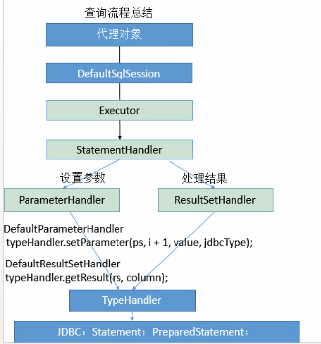

# MyBatis源码阅读

**MyBatis组件以及执行基本流程**

- SqlSessionFactoryBuilder（构造器）:它会根据配置信息或者代码生成SqlSessionFactory（工厂接口）
- SqlSessionFactory：依靠工厂来生成SqlSession。
- SqlSession：是一个既可以发送SQL去执行并返回结果的，也可以获取Mapper接口，通过Mapper接口查询并封装数据。
- SQL Mapper:它是MyBatis新设计的组件，它是由一个Java接口和XML文件（或者注解)构成的，需要给出对应的SQL和映射规则。它负责发送SQL去执行，并返回结果。

用下图表达上述组件之间的关联


---

1. SqlSessionFactoryBuilder().build(resourcesStream)

2. XMLConfigBuilder(inputStream, environment, properties)

3. parser.parseConfiguration("/configuration")

   > ```java
   >       //分步骤解析
   >       //issue #117 read properties first
   >       //1.properties
   >       propertiesElement(root.evalNode("properties"));
   >       //2.类型别名
   >       typeAliasesElement(root.evalNode("typeAliases"));
   >       //3.插件
   >       pluginElement(root.evalNode("plugins"));
   >       //4.对象工厂
   >       objectFactoryElement(root.evalNode("objectFactory"));
   >       //5.对象包装工厂
   >       objectWrapperFactoryElement(root.evalNode("objectWrapperFactory"));
   >       //6.设置
   >       settingsElement(root.evalNode("settings"));
   >       // read it after objectFactory and objectWrapperFactory issue #631
   >       //7.环境
   >       environmentsElement(root.evalNode("environments"));
   >       //8.databaseIdProvider
   >       databaseIdProviderElement(root.evalNode("databaseIdProvider"));
   >       //9.类型处理器
   >       typeHandlerElement(root.evalNode("typeHandlers"));
   >       //10.映射器
   >       mapperElement(root.evalNode("mappers"));
   > ```

4. 

5. return new DefaultSqlSessionFactory(config)

mapper.xml里面有sql语句,相当于mapper接口下的方法的实现, 一个select/update/insert/delete封装成**mappedStatement**

statementHandler处理sql预编译,设置参数等相关工作, 依赖parameterHandler, resultSetHandler

parameterHandler 设置预编译参数

resultSetHandler    



---

```java
public class Main {
    public static void main(String[] args) {
        String resources = "mybatis-config.xml";
        InputStream inputStream = Main.class.getClassLoader().getResourceAsStream(resources);
        SqlSessionFactory sqlSessionFactory = new SqlSessionFactoryBuilder().build(inputStream);

        try {
            SqlSession sqlSession = sqlSessionFactory.openSession();
            RoleMapper mapper = sqlSession.getMapper(RoleMapper.class);
            Role byId = mapper.getById(1);
            System.out.println(byId);
        } catch (Exception e) {
            e.printStackTrace();
        }
    }
}
```

