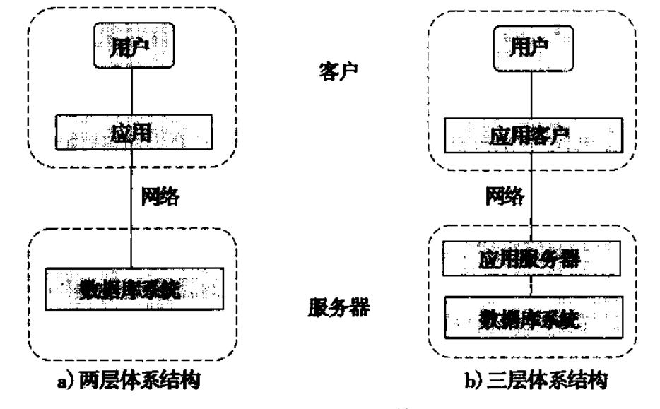
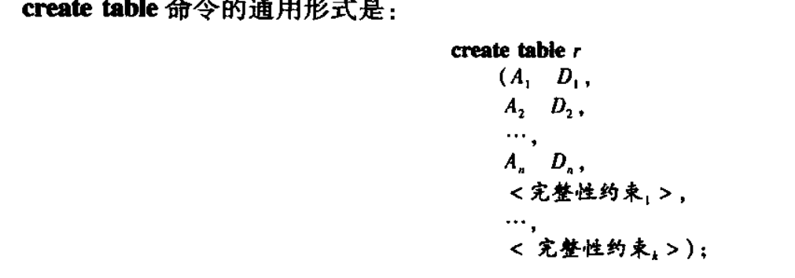
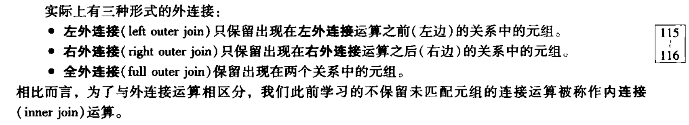

# 数据库系统概念

DBMS 数据库管理系统

数据库系统的一个主要目的是给用户提供数据的抽象视图, 也就是说, 系统隐藏了关于数据存储和维护的某些细节


### 数据库语言

#### 数据操纵语言DML

* 对存储在数据库中的信息进行检索
* 向数据库中插入新的信息
* 从数据库中删除信息
* 修改数据库中的存储的信息

#### 数据定义语言DDL

数据库系统所使用的存储结构和访问方式是通过一系列特殊的DDL语句来说明的. 

* 域约束

  声明一种属性属于某种具体的域就相当于约束它可以取得值(int, varchar, date....)

* 参照完整性

  一个关系中给的属性集上的取值也在另外一个关系的某一属性集的取值中出现(参照完整性) (外键约束)

* 断言

  一个断言就是数据库需要时刻满足的某一条件. 域约束和参照完整性约束是断言的特殊形式

* 授权

  对于不同的用户在数据库中的不同数据值上运行不同的访问类型.

  - 读权限
  - 插入权限
  - 更新权限
  - 删除权限


  ### 数据存储与查询

#### 存储管理器

存储管理器是数据库系统中负责在数据库中存储的底层数据与应用程序以及向系统提交的查询之间提供接口的部件. 存储管理器负责与文件管理器进行交互.

存储管理器部件包括:

* 权限即完整性管理器
* 事务管理器
* 文件管理器
* 缓冲区管理器
* 数据文件
* 数据字典
* 索引

#### 查询处理器

* DDL解释器
* DML编译器
* 查询执行引擎


### 数据库结构





### 关系数据库

database schema 数据库模式: 数据库的逻辑设计

**超码**: 是一个或者多个属性的集合, 这些属性的组合可以使我们在一个关系中唯一的标识一个元组

主码(primary key): 元组的最小唯一标识

外码(foreign key): 一个表可能在他的属性中包括另外一个表的主码

模式图(schema diagram): 


### SQL

#### 数据定义



r是关系名, Ai是关系r的schema中的一个属性名,Di是属性Ai的域

完整性约束: 

- primary key(A1, A2...): 主码约束, 非空且唯一
- foreign key(A3, A4 ...) references ... : 外码约束
- not null: 非空
- ...


#### SQL查询

SQL查询的基本结构由三个子句构成: select, from, where

##### 单关系查询

```sql
去除重复
select distinct dept_name 
from instructor;

指明不去除重复
select all dept_name
from instructor;
```

select子句还可以包含+ - * %运算符的算术表达式

```sql
select ID, name, dept_name, salary* 1.1
from instructor;
```

where子句中可以使用and or not逻辑连词

##### 多关系查询

```sql
select name,  instructor.dept_name, building
from instructor, department
where instructor.dept_name = department.dept_name;
```

注意dept_name属性既出现在instructor关系中, 也出现在department中, 通过使用关系名作前缀(instructor.xxx和department.xxx)来说明我们使用的是那个属性. 相反, 属性name和building只出现在一个关系中, 因此不需要把关系名作前缀


* select子句用于列出查询结果中所需要的关系列表
* from子句是一个查询求值中需要访问的关系列表
* where子句时一个作用在from子句中关系的属性上的谓词

一个典型的sql查询语句具有如下形式:

```sql
select A1, A2, A3, ..., AN
from r1, r2,r3,...rm
where P;
```

**要去除笛卡尔积**

##### 重命名

old_field_name as new_field_name

old_table_name as new_table_name

也可以省略as 用空格代替

##### 字符串运算

* %匹配任意子串
* _匹配任意一个字符

使用like来表达模式

也可以使用 not like查找不匹配项

```sql
select dept_name
from department
where building like '%Waston%';
```

##### 排列元组的显示次序

order by

默认升序, 可以显示指明. 

asc 升序, desc 降序

##### where子句谓语

* between
* order by
* like
* not, and, or
* in

##### 集合运算

union(并), intersect(交),except(差)

##### union

```sql
( select course_id
from section
where semester = 'Fall' and year = 2009 )
union
( select course_id
 from section
 where semester = 'Spring' and year = 2010);
```

union运算自动去重

使用union all保留所有重复

##### intersect, except

与union类似

except去除A在B相同的值

##### NULL

使用 is null , is not null判断空值

##### 聚合函数

* avg
* min
* max
* sum
* count

除了count(*)外, 都忽略null

##### group by

使用分组查询时, 必须保证出现在select语句中但没有被聚集的属性只能是出现在group by子句中的那些属性. 也就是**没有出现在group by 子句中的属性只能出现在聚合函数内部**

```sql
/* 错误的查询 */
select dept_name, ID, avg(salary)
from instructor
group by dept_name;
```

##### having

对group by的限定条件.  针对group by之后产生的表进行条件限定. 

**having子句中的谓语在形成分组后才起作用**, 因此可以使用聚合函数

和group by 一样的限制

```sql
select dept_name, avg(salary) as avg_salary
from instructor
group by dept_name
having avg(salary) > 42000;
```

##### 集合的比较

使用<some, <= some, >= some, = some和 <>some做比较, 表示 至少小于, 小于等于..其中的一个值

```sql
select name
from instructor
where salary > some (
	select salary 
    from instructor
    where dept_name = 'Biology'
) ;
```

< all, <= all, >= all, >all, =all和<>all

##### 空关系测试

exists

##### from子句中的子查询

```sql
select dept_name, avg_salary
from (
	select dept_name, avg(salary) as avg_salary
    from instructor
    group by dept_name
) as dept_avg (dept_name, avg_salary)
where avg_salary > 42000;
```

在内存中生成了一张子查询表, 并命名为dept_avg, 有dept_name, avg_salary两个字段.

##### with子句

替代from,where的子查询

MySql没有with as

```sql
with dept_total (dept_name, value) as
	(select dept_name, sum(salary)
	from instructor
	group by dept_name),
	dept_total_avg(value) as 
	(select avg(value)
	from dept_total)
select dept_name
from dept_total, dept_total_avg
where dept_total.value >= dept_total_avg.value;
```

##### 标量子查询

SQL允许子查询出现在**返回单个值的表达式**能够出现的任何地方, 只要该子程序只返回单个属性的单个元组.

```sql
select dept_name,
	(select count(*)
    from instructor
     where department.dept_name = instructor.dept_name
    ) as num_instructors
from department;
```

标量子查询可以出现在select, where和having子句中

#### delete

```sql
delete from r
where P;
```

P代表一个谓词, r代表一个关系. delete语句首先从r中找出所有时P(t)为真的元组t, 然后把它们从r中删除. 如果忽略where, 则删除r中所有元组.

#### insert

```sql
insert into course
	values ('CS-437', 'Database System', 'Comp. Sci', 4);
	
insert into course(course_id, title, dept_name, credits)
	values ('CS-437', 'Database System', 'Comp. Sci', 4);
```

我们可以在查询结果的基础上插入元组

```sql
insert into instructor
	select ID, name, dept_name, 18000
	from student
	where dept_name = 'Music' and tot_cred > 144;
```

#### update

```sql
update instructor
set salary = salary * 1.05;

update instructor
set salary = salary * 1.05
where salary < 70000;

update instructor
set salary = salary * 1.05
where salary < (select avg (salary)
               from instructor);
```

case结构

```sql
update instructor
set salary = case
						when salary <- 10000 then salary * 1.05
						else salary * 1.03
				end
```

case语句的一般结构

```sql
case
			when pred1 then result1
			when pred2 then result2
			when pred2 then result3
			....
			else result0
end
```


### 中级SQL

nature join = nature inner join

join on = inner join on 



#### 视图

虚表

```sql
create view faculty as
select ID, name, dept_name
from instructor;
```

##### 更新

一般情况不允许对视图关系进行修改.

#### 完整性约束

##### 单个关系上的约束

* not null

* unique

* check(<谓词>)

  check(age > 18)

  check(gender in ('male', 'female') )

##### 参照完整性

```sql
foreign key (column_name) reference table(primary_key_name or unique)
	on delete cascade
	on update cascade,
```

##### 事务中对完整性约束的违反

SQL标准预习将initially deferred 子句加入到约束声明中,  这样完整性约束不是在事务的中间步骤上检查, 而是在事务结束的时候检查.

可以执行 `set constraints constraint-list deferred`语句作为事务的一部分, 时指定约束的检查被推迟到该事务结束时执行.

默认的方式时立即检查约束.

##### 复杂check条件与断言

这些结构目前还没有被大多数数据库系统支持

```sql
check (time_slot_id in (select time_slot_id from time_slot))
```

断言: 希望数据库总能满足一个条件. 域约束和参照完整性约束时断言的特殊形式.

```sql
create assertion credits_earned_constraint check
	(not exists ( select ID
                 from student
                 where tot_cred <> (select sum(credits)
                                   		from takes natural join course
                                    	where student.ID = takes.ID
                                    	and grade is not null and grade <> 'F'
                                   )
    ));
```

#### 数据类型与模式

##### 日期和时间格式

* date

  日历日期,  年(四位),月,日

  2019-04-05

* time

  一天中的的时间, 包括小时, 分, 秒

  09:30:00

* timestamp

  date和time的组合

  2019-04-05 10:10:10.45

##### 索引

```sql
create index studentID_index on student(ID);
```

##### 临时表

```sql
# 复制表结构
create table temp_instructor like instructor;

create table t1 as 
	( select * from instructor
     where dept_name = 'Music')
     with data;
```


### 高级SQL


