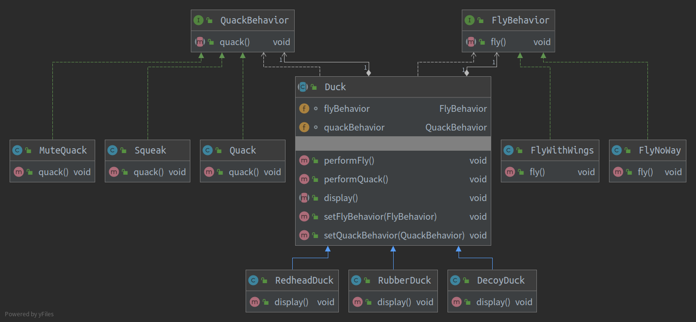

# 设计模式

#### 设计模式的七大原则

> * **单一职责原则**
>
>   > 对类来说, 一个类应该只负责一项职责
>   >
>   > 通常情况下, 我们应当遵守单一职责原则, 也可以降低到方法级别上实现单一职责原则
>
> * **接口隔离原则**
>
>   > 一个类对另一个类的依赖应该建立在最小的接口上, 将接口拆分细化
>
> * **依赖倒转原则**
>
>   > 高层模块(稳定)不应该依赖底层模块(变化),  两者应该依赖其抽象 (PizzaStore不应该依赖具体的Pizza, 应该依赖Pizza接口)
>   >
>   > 抽象(稳定)不应该依赖实现细节(变化), 实现细节应该依赖抽象
>   >
>   > **依赖倒转的核心时面向接口编程**
>   >
>   > 底层模块尽量都要有抽象类或接口
>   >
>   > 遵守里氏替换原则
>
> * **里氏替换原则**
>
>   > 使用基类的地方,可以替换为子类,且对系统没有影响
>   >
>   > 在子类中尽量不要修改父类方法
>   >
>   > 在适当情况下使用聚合,组合,依赖来解决问题(高耦合了)
>
> * **开闭原则**
>
>   > **最基础, 最重要**的设计原则
>   >
>   > 对**扩展开放**(提供方), 对**修改关闭**(使用方)
>   >
>   > 类模块应该是可扩展的, 但是不可修改
>   >
>   > 用抽象构建框架, 用实现扩展细节
>
> * **迪米特原则**
>
>   > 一个对象应该对其他对象保持最少的了解
>   >
>   > 类与类之间关系越密切, 耦合度越大
>   >
>   > 避免出现间接依赖(除返回值, 成员, 行参的情况)
>   >
>   > 目的:   降低耦合
>
> * **合成复用原则** 
>
>   > 尽量使用合成/聚合, 而不是继承
>   >
>   > 组合>聚合>关联>依赖
>
> 目的:
>
> 1. **代码重用性**
> 2. **可读性** (编程规范性)
> 3. **可扩展性**(增加性功能时, 非常方便,也称为可维护性)
> 4. **可靠性** (新增了功能后, 对原有功能没影响)
> 5. **高内聚, 低耦合** 

#### 模式分类

> 1. 创建型
>
>    > 将对象的部分创建工作延迟到子类或者其他对象,从而应对需求变化为对象创建时具体类型实现引来的冲击。
>
> 2. 结构型
>
>    > 通过类继承或者对象组合获得更灵活的结构,从而应对需求变化为对象的结构带来的冲击。
>
> 3. 行为型
>
>    > 通过类继承或者对象组合来划分类与对象间的职责,从而应对需求变化为多个交互的对象带来的冲击

#### 策略模式

 > `策略模式`定义了算法族,分别封装起来,让他们之间可以互相替换,此模式让算法的变化独立于使用算法的客户。
 >
 > > **意图**：定义一系列的算法,把它们一个个封装起来, 并且使它们可相互替换。
 > > **主要解决**：在有多种算法相似的情况下，使用 if…else 所带来的复杂和难以维护。
 > > **何时使用**：一个系统有许多许多类，而区分它们的只是他们直接的行为。
 > > **如何解决**：将这些算法封装成一个一个的类，任意地替换。
 > > **关键代码**：实现同一个接口。
 > > **应用实例**： 1、诸葛亮的锦囊妙计，每一个锦囊就是一个策略。 2、旅行的出游方式，选择骑自行车、坐汽车，每一种旅行方式都是一个策略。 3、JAVA AWT 中的 LayoutManager。
 > > **优点**： 1、算法可以自由切换。 2、避免使用多重条件判断。 3、扩展性良好。
 > > **缺点**： 1、策略类会增多。 2、所有策略类都需要对外暴露。
 > > **使用场景**： 1、如果在一个系统里面有许多类，它们之间的区别仅在于它们的行为，那么使用策略模式可以动态地让一个对象在许多行为中选择一种行为。 2、一个系统需要动态地在几种算法中选择一种。 3、如果一个对象有很多的行为，如果不用恰当的模式，这些行为就只好使用多重的条件选择语句来实现。
 > > **注意事项**：如果一个系统的策略多于四个，就需要考虑使用混合模式，解决策略类膨胀的问题。
 > >
 > > 1. 继承的局限性：
 > >    - 代码在多个子类重复
 > >    - 运行时的行为不容易改变
 > >    - 很难知道所有子类的全部行为
 > >    - 改变会牵一发而动全身,造成其他子类不想要的改变
 > >      根据设计原则
 > > 2. OO原则：
 > >    - 找出应用中可能需要变化之处,把它们独立起来,与那些不需要变化的代码分离
 > >    - 当涉及维护时,为了复用而使用继承,结局并不完美
 > >    - 多用组合,少用继承
 > >
 > > 例子：
 > >
 > > > 设计一个模拟鸭子系统
 > > > 鸭子具有飞、叫、外观的行为
 > > >
 > > > 类图如下: 
 > > >
 > > > 
 > > >
 > > > 然而当鸭子种类增加时将会带来许多问题:
 > > >
 > > > 
 > > >
 > > > 有的鸭子并不具有飞行和呱呱叫的行为,所以继承并不是适当的结局问题. 虽然可以将fly和quack抽取为接口让会飞行的鸭子实现fly接口,会叫的鸭子实现quack接口, 但是却造成了代码无法复用,甚至飞行的动作可能有很多变化.
 > > >
 > > > 此时需要把改变和不变的部分分离, 将改变的部分抽取并封装, 那么就可以轻易的改动或扩充此部分, 而不影响不需要改变的部分.
 > > >
 > > > 因此: 
 > > >
 > > > * 抽取fly()和quack()独立为两个接口
 > > > * 对fly接口实现不同的飞行行为,quack也类似
 > > > * 将实现fly的类、实现quack的类和鸭子类`组合`起来
 > > > * 那么鸭子类和fly，quack行为就不是绑死了
 > > > * 这样的设计,让飞行和呱呱叫的动作可以被复用, 而且和具体的鸭子类无关
 > > >
 > > > 
 > > >
 > > > 
 > > >
 > > > 针对接口编程真正的意思时针对超类型(supertype)编程

---

 #### 观察者模式

> **观察者模式定义了对象之间的一对多依赖, 当一个对象发生变化时, 他的所有依赖者都会收到通知并自动更新** 
>
> 主题 `Subject`
>
> > 主题对象管理某些数据, 当主题内的数据改变,就会通知观察者.
> >
> > 一旦数据改变,新的数据会通过某种方式送到观察者手上
>
> 观察者`Observer`
>
> > 观察者**`订阅`**(**`注册`**)主题,在主题数据更新时能收到更新
>
> 订阅流程: 
>
> 1. 观察者订阅主题
> 2. 主题数据更新
> 3. 主题通知所有观察者
> 4. 观察者获得最新数据
>
> 取消订阅:
>
> 1. 某一观察者要求取消订阅
> 2. 主题对象将此观察者除名
>
> ---
>
> 定义Subject接口和Observe接口
>
> 
>
> 
>
> >  Java 9：Observer和Observable废弃原因及解决方案
> >
> > Observer和Observable在Java 9标记为废弃。
> >
> > 废弃原因
> >
> > Observer和Observable有几个原因：
> >
> > 1、不能序列化
> >
> > Observable没有实现Serializable接口，它的内部成员变量都是私有的，子类不能通过继承它来对Observable的成员变量处理。所以子类也不能序列化。
> >
> > 参考：[Why is java.util.Observable class not serializable.](https://bugs.openjdk.java.net/browse/JDK-4180466)
> >
> > 2、不是线程安全
> >
> > 在 java.util.Observable文档里没有强制要求Observable是线程安全的，它允许子类覆盖重写Observable的方法，事件通知无序以及事件通知发生在不同的线程里，这些都是会影响线程安全的问题。
> >
> > 参考：[Documentation of java.util.Observable](https://bugs.openjdk.java.net/browse/JDK-8025077)
> >
> > 3、支持事件模型的功能简单
> >
> > 支持事件模型的功能很简单，例如，只是支持事情发生变化的概念，但是不能提供更多哪些内容发生了改变。
> >
> > 参考：[deprecate Observer and Observable](https://bugs.openjdk.java.net/browse/JDK-8154801)
> >
> > 解决方案
> >
> > 可以使用java.beans 里的[PropertyChangeEvent](https://docs.oracle.com/javase/9/docs/api/java/beans/PropertyChangeEvent.html) 和 [PropertyChangeListener](https://docs.oracle.com/javase/9/docs/api/java/beans/PropertyChangeListener.html) 来代替目前Observer和Observable的功能。

#### 装饰者模式

> 装饰者模式: 动态的讲责任附加到对象上,若要扩展功能,装饰者提供比继承更加弹性的替代方案
>
> 装饰者与被装饰者有相同的超类型
>
> 可以用一个或多个装饰者包装一个对象
>
> 装饰者可以在委托被装饰者的行为之前或之后,加上自己的行为,已达到特定的目的
>
> Decorator类在接口上表现为 is-a Component的继承关系, 但在实现上又表现为has-a Component的组合关系, 即Decorator类又使用了另外的一个Component类

#### 工厂模式

> * `工厂方法模式`定义了一个**创建对象的接口**(超类型), 但由子类决定要实例化的类是哪一个. 工厂方法让类把实例化**推迟**到子类. 把创建对象委托给子类,**子类实现工厂方法**来创建对象
>
>   > 
>   >
>   > ```java
>   > public abstract class PizzaStore {
>   > 
>   >     public Pizza orderPizza(String type) {
>   >         Pizza pizza;
>   > 
>   >         pizza = createPizza(type);
>   > 
>   >         pizza.prepare();
>   >         pizza.bake();
>   >         pizza.cut();
>   >         pizza.box();
>   >         return pizza;
>   >     }
>   > 
>   >     protected abstract Pizza createPizza(String type);
>   > }
>   > ```
>   >
>   > ```java
>   > public class NYPizzaStore extends PizzaStore {
>   >     @Override
>   >     public Pizza createPizza(String type) {
>   >         switch (type){
>   >             case "cheese": return new NYStyleCheesePizza();
>   >             case "clam": return new NYStyleClamPizza();
>   >             case "pepperoni": return new NYStylePepperoniPizza();
>   >             default: return null;
>   >         }
>   >     }
>   > }
>   > ```
>   >
>   > ```java
>   > public class ChicagoPizzaStore extends PizzaStore {
>   >     @Override
>   >     public Pizza createPizza(String type) {
>   >         switch (type){
>   >             case "cheese": return new ChicagoStyleCheesePizza();
>   >             case "clam": return new ChicagoStyleClamPizza();
>   >             case "pepperoni": return new ChicagoStylePepperoniPizza();
>   >             default: return null;
>   >         }
>   >     }
>   > }
>   > ```
>   >
>   > 
>
> * `抽象工厂`使用对象组合, 对象创建被实现在工厂接口所暴露的方法中
>
>   > 一系列相互依赖的对象的创建工作
>   >
>   > **系列对象的创建**
>   >
>   > 提供一个接口, 让该接口负责创建一系列相关或者相互依赖的对象, 无需指定他们具体的类
>
> * `简单工厂`中, 实例化由类外的接口统一提供
>
>   > 
>   >
>   > ```java
>   > public class PizzaStore {
>   >     SimplePizzaFactory simplePizzaFactory;
>   > 
>   >     public PizzaStore(SimplePizzaFactory simplePizzaFactory){
>   >         this.simplePizzaFactory = simplePizzaFactory;
>   >     }
>   > 
>   >     public Pizza orderPizza(String type) {
>   >         Pizza pizza = createPizza(type);
>   >         pizza.prepare();
>   >         pizza.bake();
>   >         pizza.cut();
>   >         pizza.box();
>   >         return pizza;
>   >     }
>   > 
>   >     protected Pizza createPizza(String type) {
>   >         return simplePizzaFactory.createPizza(type);
>   >     }
>   > }
>   > ```
>   >
>   > ```java
>   > public class SimplePizzaFactory {
>   >     public Pizza createPizza(String type) {
>   >         switch (type) {
>   >             case "cheese": return new CheesePizza();
>   >             case "pepperoni": return new PepperoniPizza();
>   >             case "clam": return new ClamPizza();
>   >             case "veggie": return new VeggiePizza();
>   >             default: return null;
>   >         }
>   >     }
>   > }
>   > ```
>   >
>   >  
>

#### 模板模式

> 定义一个操作中的算法骨架(稳定), 而将一些步骤延迟(变化)到子类.
>
> 模板方法使得子类可以不改变(复用)一个算法的结构即可重定义(override)算法的某些步骤
>
> 抽象方法一般用protected修饰

#### 桥模式

> 将抽象部分(业务功能)与实现部分(平台实现)分离, 使他们都可以独立的变化
>
> ???

#### 原型模式Prototype

> 使用原型实例指定创建的种类, 然后通过克隆这些原型来创建新的对象
>
> 内部结构复杂的对象创建比较麻烦, 最好的方式就是clone(深)了
>
> 开发中用的少

#### 建造者模式

> 将一个复杂对象的构建与其表示想分离, 使得同样的构建过程(稳定)可以创建不同的表示(变化)
>
> 分离出一个Builder类

#### 单例模式

> 一个类只有一个实例
>
> 私有化构造器, 禁止继承.  持有一个实例对象, 提供返回此对象的静态接口
>
> ```java
> public class A {
>     private static volatile A a;  // 实现双检查锁一定要加volatile关键字
>     
>     private static A a = new A(); // 另一种一开始就加载的
>     private A() {}
>     
>     // 线程不安全
>     public static A getInstance(){
>     	if ( a == null) {
>             a = new A();
>         }
>       return a;
> 		}
>     
>     // 加锁, 线程安全
>     public static A getInstance(){
>       synchronized(A.class) {
>         if ( a == null) {
>             a = new A();
>         }
>       }
>       return a;
> 		}
>     
>     // 双检查锁, 可能会指令重排
>     public static A getInstance(){
>         if (a == null) {
>             synchronized(A.class) {
>                 if (a == null) {
>                     a = new A();
>                 }
>             }
>          }
>       return a;
> 		}  
> }
> ```

#### 享元模式

> 运用共享技术有效的大量支持大量细粒度的对象

#### 门面模式

> 在组件的构建过程中, 某些接口之间直接的依赖常常会带来许多问题, 甚至是根本无法实现. 采用添加一层间接(稳定)接口, 来隔离本来相互紧密关联的接口是一种常见的方案
>
> 为子系统中的一组接口提供一个一致(稳定)的界面, Facade模式定义了一个高层接口, 通过这个接口使得这一子系统更加容易使用(复用)
>
> 系统外与系统内的**隔离**
>
> 

#### 代理模式

> 无法修改一个类的源码, 又想要对这个类增加新的处理逻辑

#### 适配器模式

> 将一个类的接口转化为另一个接口, Adapter模式使得原来由于接口不兼容而不能工作的那些类可以一起工作
>
> 希望复用一些现存的类, 但是接口又与复用环境要求不一致的情况, 在遗留代码复用, 类库迁移等方面非常有用
>
> GoF23定义了两种Adapter模式的实现结构: **对象适配器**和类适配器. 但类适配器采用继承的实现方式,一般不推荐使用. 对象适配器采用对象组合方式, 更符合**松耦合**精神
>
> Adapter模式可以实现的非常灵活

#### 中介者 Mediator

> 在软件构建过程中,经常会出现多个对象相互关联交互的情况, 对象之间常常会维持一种复杂的引用关系, 如果遇到一些需求的变更, 这种直接的引用关系将面临不断的变化
>
> 用一个中介对象来封装一系列的对象交互. 中介者使个对象不需要显示的相互引用(编译时依赖 -> 运行时依赖), 从而时期耦合松散, 并且可以独立的改变它们之间的交互
>
> 系统内**隔离**

#### 状态模式

> 在组件构建过程中, 某些对象的状态经常面临变化, 如何对这些变化进行有效的管理? 同时又维持高层模块的稳定?
>
> 某些对象的**状态**如果**改变**, 其**行为**也会随之发生变化, 如何在运行时根据状态来透明的更改对象的行为, 而不会为对象操作和状态转化之间引入紧耦合
>
> state模式将所有与一个特定状态相关的行为都放入一个state的子类对象中, 在对象转台切换时, 切换相应的对象, 但同事维持state的接口, 这样实现了具体的操作与状态之间的解耦 

#### 备忘录

> 在不破坏封装性的前提下, 捕获一个对象的内部状态, 并在盖对象之外保持这个状态. 这样以后就可以将该对象恢复到原先保持的状态
>
> **序列化替代**

#### 组合模式

> 客户代码过多的依赖于对象容器复杂的内部结构, 对象容器内部实现结构(而非抽象接口)的变化将引起客户代码的频繁变化, 带来了代码的维护性, 扩展性等弊端
>
> 将对象组合成**树形结构**以表示**部分-整体**的层次结构. Composite使得用户对单个对象和组合对象的使用具有**一致性**(稳定)
>
> 采用树形结构来实现普遍存在的对象容器, 从而将**一对多**的关系转化为**一对一**的关系, 使得客户代码可以一致的(复用)处理对象和对象容器, 无需关心处理的时单个对象还是组合的对象容器
>
> 将**客户代码与复杂的对象容器结构**解耦时组合模式的核心思想, 解耦后, 客户代码将于纯粹的**抽象接口**, 而非**对象容器的内部实现结构**发生依赖

#### 迭代器

> 提供一种顺序访问一个聚合对象中的各种元素, 而又不暴露(稳定)该对象的内部表示

#### 职责链

> 一个请求可能被多个对象处理, 但是每个请求在运行时只能有一个接受者, 如果显示指定, 将必不可少的带来请求发送者和接受者的紧耦合
>
> 让请求发送者**不需要指定**具体的接受者, 让**请求接受者**自己在运行时决定来**处理请求**
>
> 使多个对象都有机会处理请求, 从而避免请求的发送者和接受者之间的耦合. 将这些对象连成一条链, 并沿着这条链传递请求, 直到有一个对象处理它为止

#### 命令模式

> 将一个**请求(行为)封装为一个对象**, 从而使你可用不同的请求对客户进行参数化, 对请求排队或记录请求日志, 以及支持可撤销的操作
>
> 目的: 将行为请求者与行为实现者解耦, 将**行为抽象为对象**
>
> 可以使用组合模式将多个命令封装为一个复合命令
>
> 行为由编译时绑定转化为运行时绑定

####  访问器

> 一个作用于某对象结构中的个元素操作, 使得可以在不改变(稳定)各元素的类的前提下定义(扩展)作用于这些元素的新操作(变化)
>
> 访问者模式通过双重分发(double dispatch)来实现不更改(编译时不添加新的操作)类层次结构的前提下, 在运行时透明的为类层次结构上的各种类动态的添加新的操作(支持变化)
>
> 双重分发就是访问器模式中间包括了两个多态分发: 第一个为accept方法的多态调用, 第二个为visitElementX方法的多态调用
>
> 访问者模式最大的缺点是在于扩展类层次结构(增加新的Element子类), 会导致Visitor类的改变, 所以Visitor模式适用于Element类层次结构稳定, 其中操作却经常面临频繁改动的情况
>
> 

#### 解析器

> 如果某一特定领域的问题比较复杂, 类似的结构不断重复出现, 如果使用普通的编程方式来实现将面临非常频繁的变化

#### 总结

> 1. 管理变化, 提高复用
> 2. 分解 vs 抽象
> 3. 对象组合优于继承
> 4. 封装变化点
> 5. 面向接口编程
> 6. 不要为模式而模式
> 7. 关注抽象类和接口
> 8. 理清变化点和稳定点
> 9. 审视依赖关系
> 10. 要有框架和应用的隔离思维
> 11. 良好的设计时演化的结果
>
> 

设计模式的七大原则:

1. 单一职责原则

2. 接口隔离原则

3. 依赖倒置原则

4. 里式替换原则

   .....